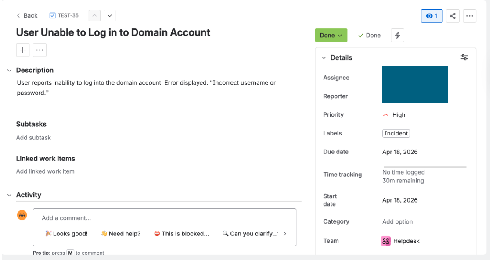
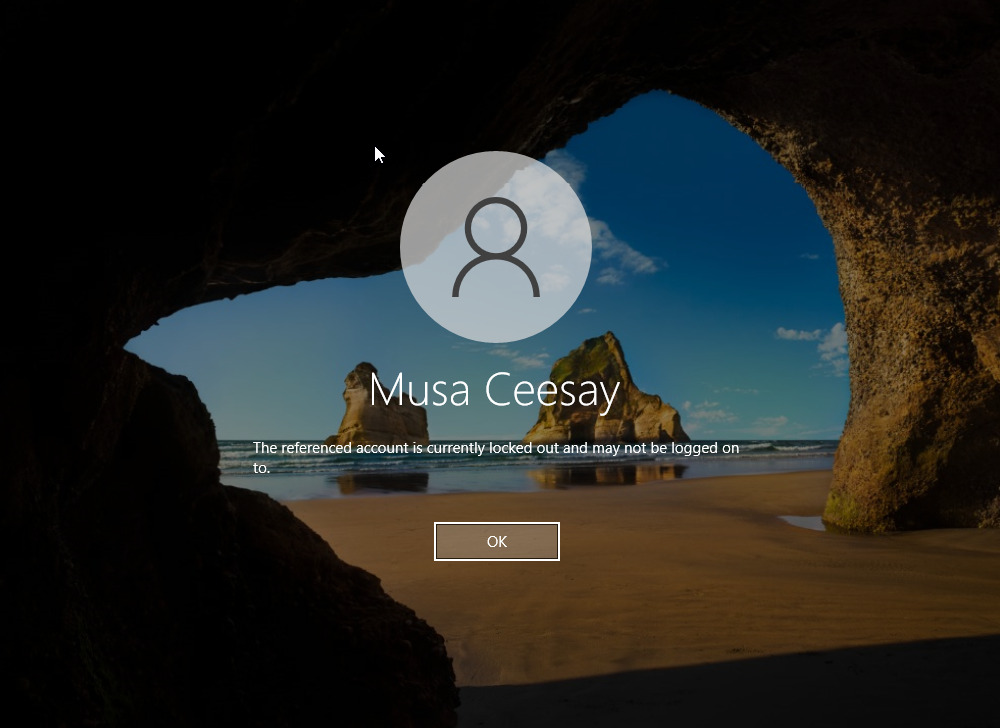
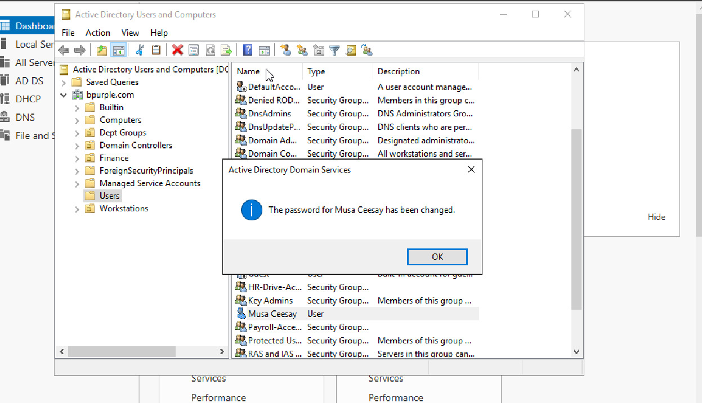
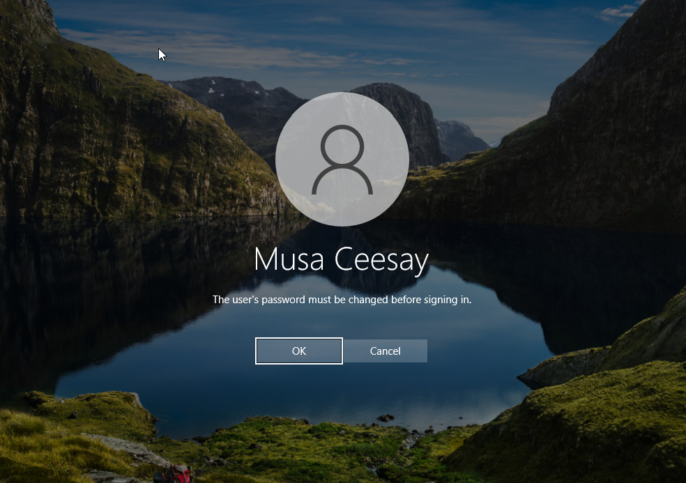
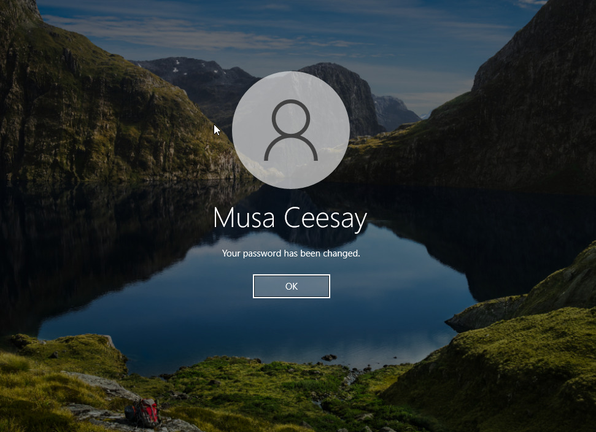

# Active Directory – User Account Lockout & Password Reset

## Overview

In this lab, I set up and tested an account lockout scenario within an Active Directory environment to better understand how login failures are handled and resolved in a real-world IT support setting.

The idea behind this was simple: replicate a situation where a user is unable to log in, investigate the root cause, and resolve it using standard Active Directory tools. This is one of the most common issues in enterprise environments, and I wanted to go beyond theory by actually simulating and fixing it end-to-end.

---

## Ticket Overview (Jira)

To simulate a real-world IT support workflow, I created and tracked this incident in a ticketing system (Jira).

This allowed me to document the issue, assign priority, and follow a structured resolution process similar to what is done in production environments.



The ticket was marked as **Resolved** after successful password reset and account unlock, with user access fully restored.

## Ticket Information

**Title:** User unable to log in to domain account

**Type:** Incident
**Priority:** High

**SLA:** 4 hours
**Original Estimate:** 30 minutes
**Due Date:** Same business day

**Reported Issue:**
User reports inability to log into their domain account with the message:

> “Incorrect username or password”

**Impact:**
User is unable to access their workstation and perform daily tasks

**Urgency:**
High – blocks productivity

**Assigned To:** IT Support (Lab Simulation)

---

## Lab Environment

To simulate this scenario, I used the following setup:

* **Domain Controller:** Windows Server (DC01)
* **Client Machine:** Windows 10 (WIN10-CLIENT)
* **Domain:** bpurple.com
* **Test User:** Musa Ceesay

---

## What I Set Out to Do

* Configure an account lockout policy using Group Policy
* Trigger a lockout from the client machine
* Identify the issue from the Domain Controller
* Reset the user’s password and unlock the account
* Validate that the user can log in successfully again

---

## Step 1 – Configuring Account Lockout Policy

I started by configuring a domain-level Group Policy to enforce account lockout after repeated failed login attempts.

**Path followed:**

Computer Configuration → Policies → Windows Settings → Security Settings → Account Policies → Account Lockout Policy

**Settings applied:**

* Account lockout threshold: 3 failed attempts
* Account lockout duration: 15 minutes
* Reset account lockout counter after: 15 minutes

This ensures that after three incorrect login attempts, the account is automatically locked.

---

## Step 2 – Simulating the Login Failure

On the Windows 10 client machine, I attempted to log in using the domain account:

```
bpurple\musaceesay
```

I intentionally entered the wrong password multiple times to trigger the lockout policy.

After the third attempt, the system enforced the policy and blocked access.

---

## Step 3 – Confirming the Lockout

At this point, the system returned the following message:

> “The referenced account is currently locked out and may not be logged on to.”

This confirmed that the policy was working as expected.



---

## Step 4 – Investigating from the Domain Controller

I switched to the Domain Controller and opened **Active Directory Users and Computers**.

From there, I navigated to the **Users** container and located the affected account (**Musa Ceesay**).

Opening the account properties allowed me to confirm that the account had indeed been locked.

---

## Step 5 – Resetting the Password and Unlocking the Account

To resolve the issue, I:

* Reset the user’s password
* Unlocked the account

Once the password reset was completed, Active Directory confirmed the update.



---

## Step 6 – Enforcing Password Change at Next Login

After resetting the password, I attempted to log in again from the client machine.

As expected, I was prompted with:

> “The user’s password must be changed before signing in.”

This is standard behavior when an administrator resets a password.



---

## Step 7 – Completing Password Change

I proceeded to set a new password directly on the client machine.

Once completed, the system confirmed:

> “Your password has been changed.”



---

## Step 8 – Verifying Resolution

After updating the password, I was able to log in successfully.

At this point, the issue was fully resolved:

* Account unlocked
* Password updated
* User access restored

---

## Key Takeaways

Working through this scenario reinforced a few important points for me:

* Account lockouts are often the result of repeated failed login attempts, not necessarily system faults
* Group Policy plays a central role in enforcing security controls
* Password resets from Active Directory typically require a user to update credentials at next login
* Troubleshooting always requires validating both the user experience and backend configuration

---

## Real-World Perspective

This lab reflects a very common helpdesk situation:

> A user reports they can’t log in, but the issue isn’t immediately obvious from their perspective.

In practice, resolving this requires:

* Checking account status in Active Directory
* Understanding lockout policies
* Taking corrective action (unlock + reset)
* Verifying the fix from the user side

---

## Conclusion

This exercise helped me build confidence in handling one of the most frequent support issues in a domain environment.

Rather than just reading about account lockouts, I walked through the full process — from triggering the issue to resolving it — which gave me a clearer understanding of both the technical and practical sides of IT support.
