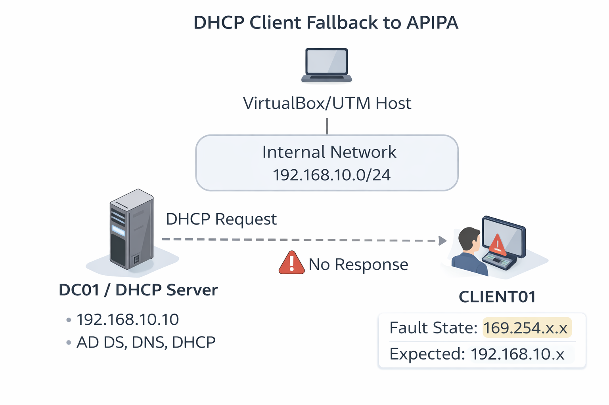
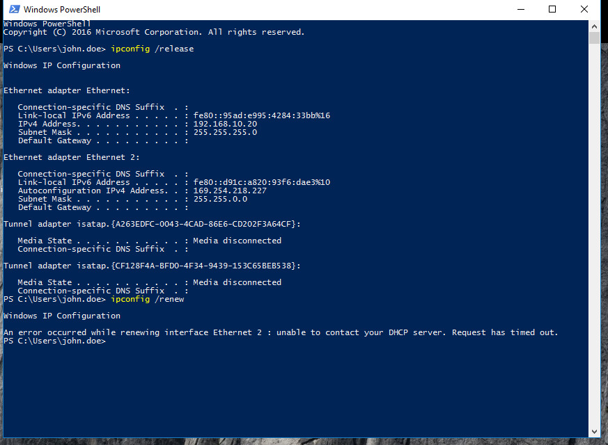
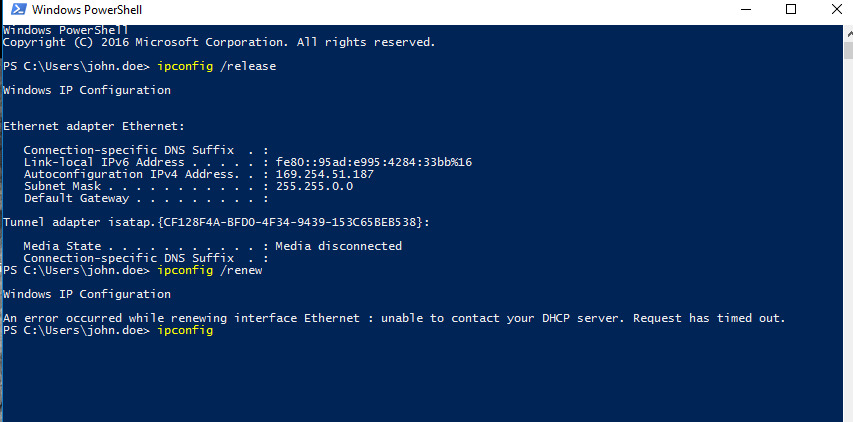

# DHCP Failure – APIPA Address (169.254.x.x)

## Ticket Information

- **Category:** Networking / DHCP / IT Support  
- **Priority:** P3 – Medium  
- **Impact:** Single user unable to obtain a valid IP address  
- **SLA Target:** 4 hours  
- **Resolution Time:** 40 minutes (within SLA)  
- **Status:** Resolved  

---

## Scenario

**User Reported:**

> “My computer cannot access the network or internet.”

The workstation was unable to reach internal resources and appeared disconnected from the corporate network.

---

## Environment

- **Client Machine:** Windows 10 / Windows 11  
- **Network:** Corporate LAN (DHCP Enabled)  
- **DHCP Server:** Windows Server (192.168.10.x range)  
- **Virtualization:** VirtualBox Lab Environment  
- **Network Range:** 192.168.10.0 / 24  

---

## Network Architecture



---

## Initial Symptoms

Running the following command:

```bash
ipconfig
```

Returned:

```
IPv4 Address . . . . . . . : 169.254.x.x
Subnet Mask . . . . . . . : 255.255.0.0
Default Gateway . . . . . :
```

The workstation automatically assigned itself a **169.254.x.x address**.

This is known as **APIPA (Automatic Private IP Addressing).**

---

## What This Indicates

When a system receives a **169.254.x.x address**, it means:

- The client attempted to contact a **DHCP server**
- No response was received
- Windows automatically assigned an **APIPA address**

With an APIPA address:

- The device cannot communicate outside its local link
- It cannot reach servers or network resources

---

## Evidence — Issue Identification

### ❌ APIPA Address Detected





---

### ❌ DHCP Renewal Failure

Attempted to renew the IP address:

```bash
ipconfig /renew
```

Result:

```
An error occurred while renewing interface Ethernet:
unable to contact your DHCP server.
Request has timed out.
```


---

## Business Impact

Without a valid DHCP lease:

- The workstation cannot access internal servers  
- Domain authentication may fail  
- Shared drives and printers become inaccessible  
- Internet connectivity may be unavailable  

---

## Investigation Steps

### Step 1 — Identify Current IP Address

```bash
ipconfig
```

Observed:

```
169.254.x.x
```

This confirmed **APIPA assignment**.

---

### Step 2 — Release Current IP Address

```bash
ipconfig /release
```

This clears the current configuration.

---

### Step 3 — Request New IP from DHCP Server

```bash
ipconfig /renew
```

Result:

```
Request has timed out.
```

The DHCP server could not be reached.

---

### Step 4 — Test Network Connectivity

To verify that the network interface was functioning, I tested connectivity to another device.

```bash
ping 192.168.10.10
```

Result:

```
Reply from 192.168.10.10
```

This confirmed:

- The network adapter was working  
- Physical connectivity existed  

---

## Root Cause

The client system could not successfully communicate with the **DHCP service**, preventing it from receiving a valid IP address.

This resulted in Windows assigning an **APIPA address (169.254.x.x).**

---

## Resolution Steps

To restore proper network configuration:

1. Verified network adapter status  
2. Confirmed DHCP server availability  
3. Reinitiated DHCP request:

```bash
ipconfig /release
ipconfig /renew
```

Once communication with the DHCP server was restored, the system obtained a valid IP address.

---

## Evidence — Successful DHCP Assignment

After renewal:

```bash
ipconfig
```

Result:

```
IPv4 Address . . . . . . . : 192.168.10.x
Subnet Mask . . . . . . . : 255.255.255.0
Default Gateway . . . . . : 192.168.10.1
```

The client successfully obtained a **valid DHCP lease**.

---

## Verification

Confirmed the following:

- Valid IP address assigned  
- Gateway reachable  
- Internal network resources accessible  
- Internet connectivity restored  

User confirmed issue resolved.

---

## Skills Demonstrated

- DHCP troubleshooting  
- APIPA identification  
- Windows networking diagnostics  
- Command-line troubleshooting  
- Root cause analysis  
- Structured incident documentation  

---

## Key Takeaway

Recognizing a **169.254.x.x address (APIPA)** is one of the fastest ways to identify DHCP communication problems.

Simple diagnostic commands such as:

```
ipconfig
ipconfig /release
ipconfig /renew
ping
```

can quickly isolate DHCP issues from general network failures.

---

## Conclusion

The issue was caused by the workstation being unable to reach the DHCP server, resulting in an APIPA address assignment.

Restoring DHCP communication allowed the system to obtain a valid IP address and resume normal network operation.

This scenario reflects a **common real-world IT support issue handled by service desk and infrastructure teams**.
