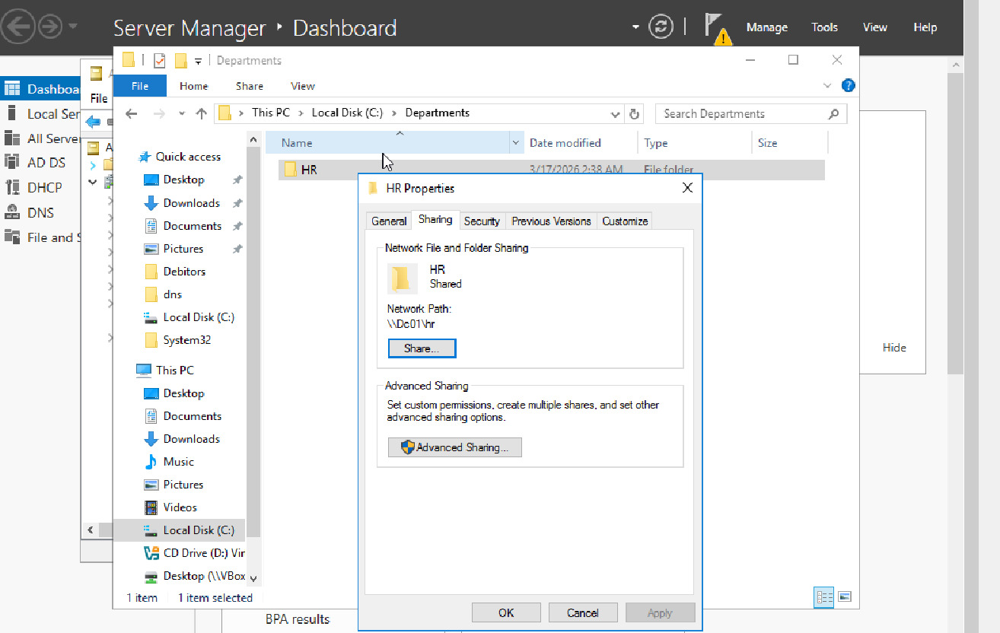
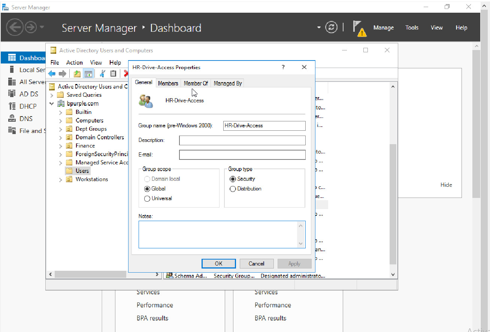
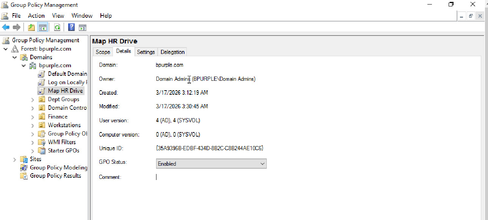
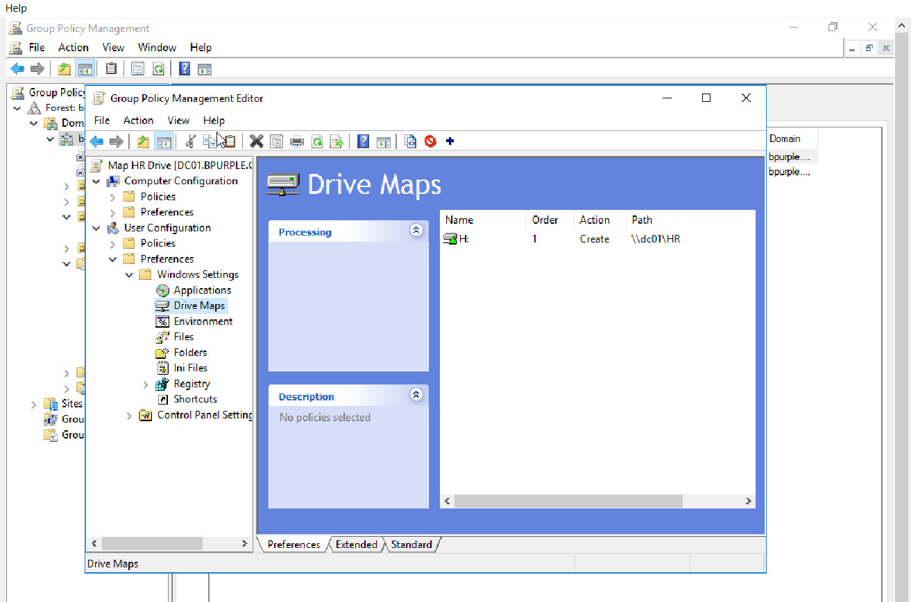
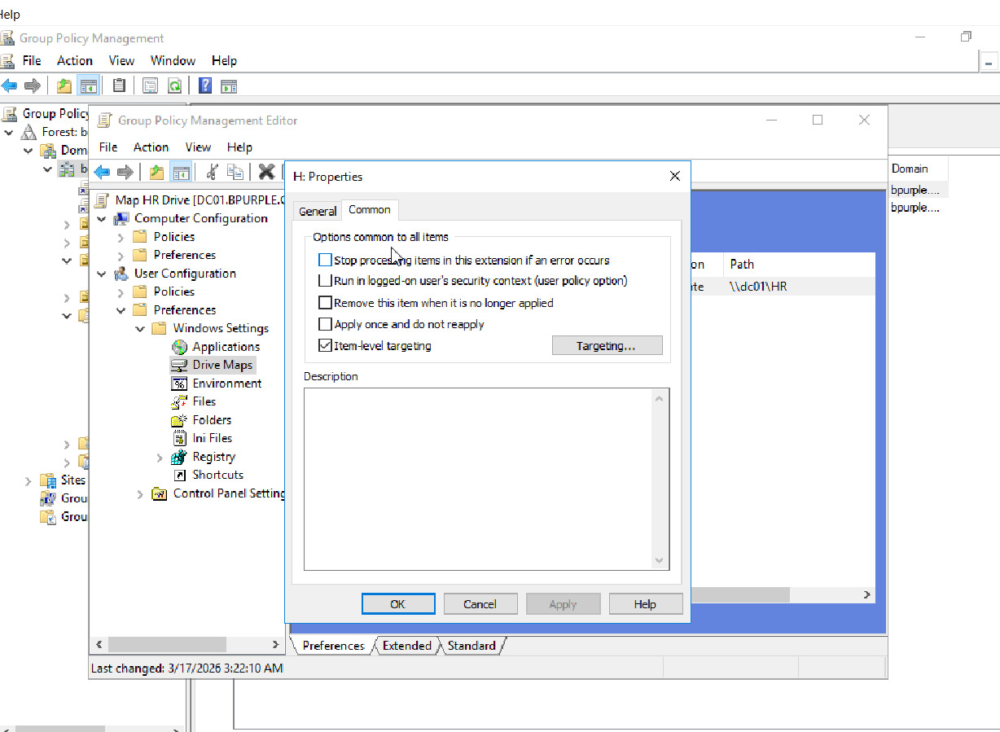
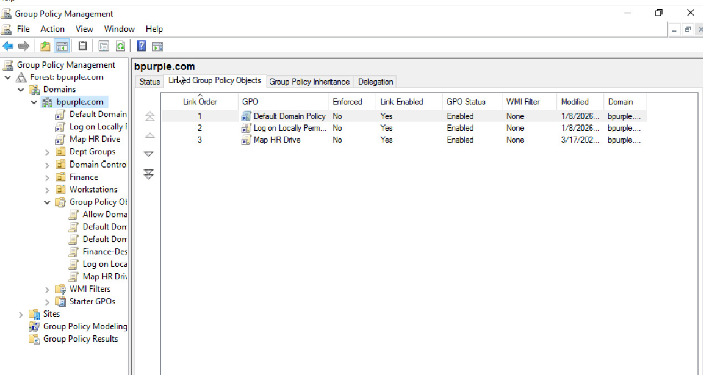
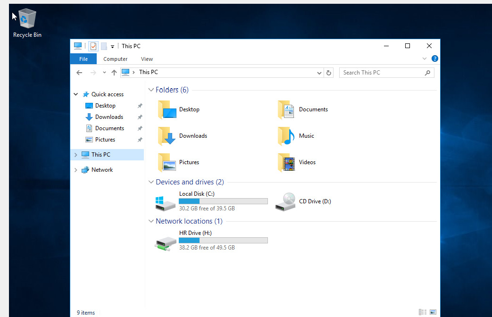

# 🚀 Group Policy Drive Mapping – Automated Network Drive Deployment

This lab demonstrates how to automate network drive mapping using Group Policy (GPO) with security group targeting in a Windows Server environment.

It simulates a real-world enterprise scenario where IT administrators configure centralized access to shared resources without manual user configuration.

---

## 📌 Lab Objective

To configure a Group Policy Object (GPO) that automatically maps a shared network drive for authorized users based on Active Directory security group membership.

This approach ensures centralized, scalable, and secure access management in enterprise environments.

---

## 🧠 Real-World Scenario

Users in the HR department require automatic access to a shared folder without manual configuration.

Instead of mapping drives manually on each workstation, administrators use Group Policy to automate access control.

---

## 🖥️ Lab Environment

| System   | Role              | IP Address    |
|----------|-------------------|---------------|
| DC01     | Domain Controller | 192.168.10.10 |
| CLIENT01 | Windows Client    | DHCP          |
| Domain   | Active Directory  | bpurple.com   |

---

## ⚙️ Technologies Used

- Active Directory Domain Services (AD DS)
- Group Policy Management (GPMC)
- Windows Server 2016
- NTFS & Share Permissions

---

## 🔧 Configuration Steps

### 1. Create Shared Folder

A shared folder was created on the domain controller:

C:\HR  

Network path:  
\\dc01\HR  

---

### 2. Create Security Group

A security group was created in Active Directory:

HR-Drive-Access  

Users were added to this group to control access.

---

### 3. Create Group Policy Object (GPO)

A new GPO was created:

Map HR Drive  

---

### 4. Configure Drive Mapping

Path:

User Configuration → Preferences → Windows Settings → Drive Maps  

Configuration used:

- Action: Create  
- Location: \\dc01\HR  
- Label: HR Drive  
- Drive Letter: H:  

---

### 5. Configure Item-Level Targeting

Item-level targeting was enabled to restrict access to specific users.

Condition applied:

Security Group = HR-Drive-Access  

---

### 6. Link GPO to Domain

The GPO was linked to:

bpurple.com  

---

### 7. Testing & Validation

On CLIENT01:

Run:

gpupdate /force  

Then log off and log back in.

Verify that the mapped drive appears under "This PC" → Network locations.

---

## ✅ Result

The HR drive (H:) was automatically mapped for the user.

---

## 🔍 Troubleshooting Scenario

### Issue:
Drive not appearing

### Possible Causes:
- User not in HR-Drive-Access group  
- Group Policy not applied  
- Incorrect permissions  

### Resolution:

The issue was resolved by performing the following steps:

- Verified that the user was correctly added to the **HR-Drive-Access** security group  
- Forced Group Policy update using `gpupdate /force`  
- Logged off and back on to ensure policy application  

### Outcome:

The Group Policy was successfully applied, and the HR network drive (H:) was automatically mapped on the client machine.

This confirmed that access control and GPO configuration were functioning as expected.

This demonstrates how Group Policy relies on user logon cycles to apply configuration changes in a domain environment.

---

## 📊 Business Impact

- Centralized access management through Group Policy  
- Reduced manual configuration across multiple endpoints  
- Improved security using role-based (group-based) access control  
- Scalable solution for growing organizations  
- Reduced human error in user access provisioning  

---

## 🔐 Security Considerations

Access to the shared folder is controlled using Active Directory security groups rather than assigning permissions directly to users.

This approach:

- Follows the principle of least privilege  
- Simplifies permission management  
- Enhances auditability and compliance  

---

## 🧠 Skills Demonstrated

- Group Policy (GPO) configuration  
- Active Directory security group management  
- Network drive mapping  
- Access control implementation  
- Windows Server administration  
- Enterprise IT automation  

---

## 💡 Key Takeaway

Using Group Policy with security groups allows organizations to automate access control efficiently and securely.

---

## ✅ Conclusion

This lab demonstrates how enterprise IT teams automate resource access using Group Policy, improving efficiency and security in a domain environment.

---

## 🚀 Portfolio Value

This project reflects real-world IT support and system administration tasks using enterprise tools and best practices.