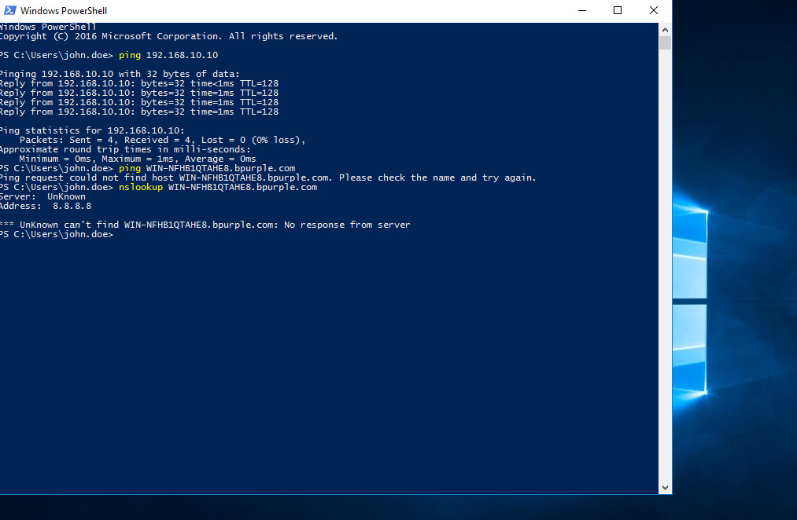
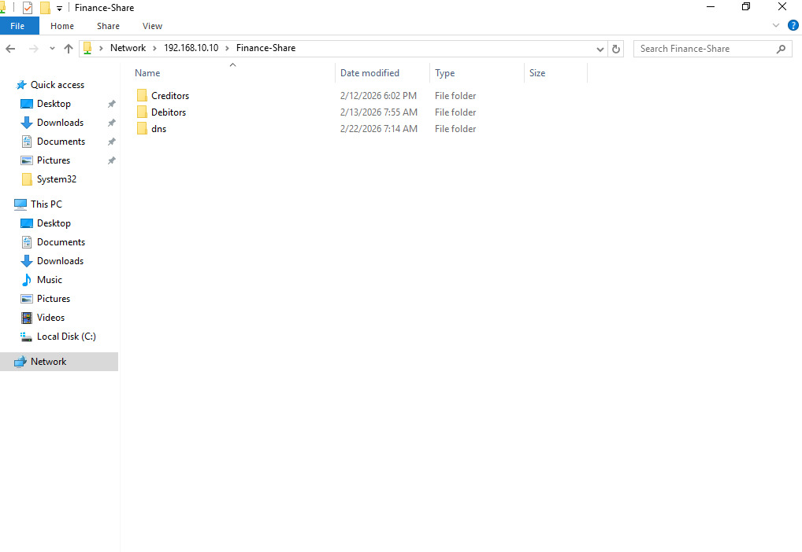

# VPN Connected but Cannot Access Shared Drives

## Ticket Information

- **Category:** Networking / VPN / Active Directory  
- **Priority:** P2 – High  
- **Impact:** Remote user unable to access internal shared resources  
- **SLA Target:** 4 hours  
- **Resolution Time:** 1 hour (within SLA)  
- **Status:** Resolved  

---

## Scenario

**User Reported:**

> “VPN connects but I can’t access shared drives.”

When attempting to access internal resources, the user received:

    Network path not found

VPN client showed status:

    Connected

However, internal shared drives such as:

    \\DC01\Finance-Share

were inaccessible.

---

## Environment

- **Domain:** bpurple.com  
- **Domain Controller:** DC01 (192.168.10.10)  
- **Client Machine:** Domain-joined Windows 11  
- **VPN Type:** Remote Access VPN  
- **Internal Network:** 192.168.10.0/24  
- **Virtualization:** VirtualBox (Internal Network + NAT)  
- **DNS Server:** 192.168.10.10  

---

## Initial Symptoms

After VPN connection:

    ping 192.168.10.10
    ping dc01.bpurple.com

Result:

    Request timed out

Attempting to open:

    \\DC01\Finance-Share

Result:

    Network path not found

VPN connection appeared active but internal network communication failed.

---

## Evidence — Issue Identification

### ❌ VPN Connectivity Failure

### ❌ Incorrect DNS Configuration

---

## Business Impact

- Remote productivity disrupted  
- Business files inaccessible  
- Collaboration delayed  
- Increased dependency on IT support  

This issue directly impacted remote operations.

---

## Investigation Steps

### Step 1 — Validate VPN Connection

Confirmed VPN client status:

    Connected

Verified that the client received a VPN-assigned IP address.

---

### Step 2 — Test Internal Network Connectivity

Executed:

    ping 192.168.10.10

Result:

    Request timed out

This indicated internal routing or DNS issues over VPN.

---

### Step 3 — Test DNS Resolution

Executed:

    ping dc01.bpurple.com

Result:

    Request timed out

Hostname resolution failed.

---

### Step 4 — Inspect DNS Configuration

Executed:

    ipconfig /all

Observed:

    DNS Servers . . . . . . . : 8.8.8.8

External DNS detected (incorrect for domain environment).

---

## Root Cause

The VPN connection was established successfully, but the client was using an external DNS server:

    8.8.8.8

Instead of the internal domain DNS:

    192.168.10.10

As a result:

- Internal hostnames could not resolve  
- Domain resources were unreachable  
- Shared drives were inaccessible  

---

## Resolution Steps

1. Open network adapter settings:

    ncpa.cpl

2. Navigate to VPN adapter → Properties  
3. Open IPv4 settings  
4. Set DNS server to:

    192.168.10.10

5. Reconnect VPN  
6. Flush DNS cache:

    ipconfig /flushdns

7. Retest connectivity:

    ping 192.168.10.10
    ping dc01.bpurple.com

Result:

    Reply from 192.168.10.10

---

## Evidence — Resolution

### ✅ DNS Fixed

### ✅ Successful Connectivity

---

## Additional Observation

### ⚠️ Access Denied (Permission Issue)

After DNS fix:

- Network connectivity: ✅  
- DNS resolution: ✅  
- Access issue: ❌ (permissions related)

This confirms the VPN/DNS issue was resolved and a separate permissions issue remained.

---

## Verification

- VPN connected successfully  
- Internal server reachable via IP  
- Hostname resolution successful  
- Shared folder accessible  
- User confirmed issue resolved  

Remote access functionality restored.

---

## Skills Demonstrated

- VPN troubleshooting  
- DNS configuration validation  
- Network vs DNS issue isolation  
- Active Directory connectivity troubleshooting  
- Structured L1/L2 troubleshooting methodology  
- Professional documentation practices  

---

## Key Takeaway

A VPN status of **"Connected"** does not guarantee access to internal resources.

Effective troubleshooting requires:

1. Validate VPN connection  
2. Test internal IP connectivity  
3. Test hostname resolution  
4. Confirm DNS configuration  
5. Check access permissions  

---

## Conclusion

The issue was caused by incorrect DNS configuration on the VPN client.

Updating the DNS server to the internal domain controller restored connectivity and access to internal resources.

This scenario reflects a real-world enterprise support issue and highlights the importance of DNS in VPN and Active Directory environments.