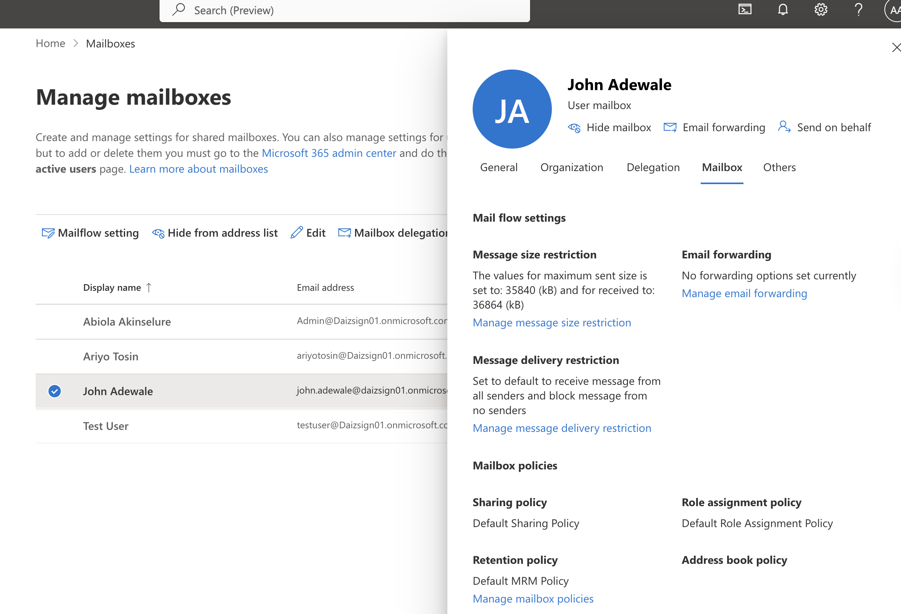
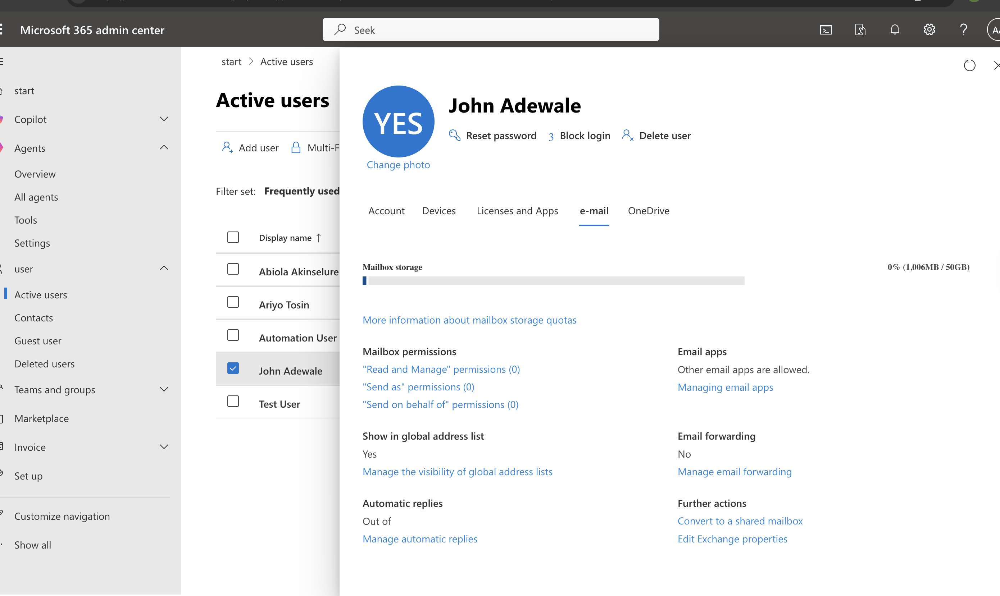

# 📌 **Microsoft 365 Mail Flow Issue — Attachment Size Limitation**

## 🧾 Overview

I simulated a real-world support scenario where a user reported that they could access Outlook but were unable to send emails.

Instead of assuming it was an Outlook issue, I approached it the same way I would handle a real ticket in a support environment — step by step, focusing on isolating the root cause.

---

## 🎫 Ticket Summary

Title: Emails are not sending
Category: Exchange Online / Email
User: John Adewale
Priority: Medium
Status: Resolved

**User Issue:**

> “I can open Outlook, but my emails are not sending.”

---

## 🔍 Investigation

The first thing I did was avoid jumping to conclusions. Since the user could access Outlook, I knew this wasn’t an authentication or login issue.

### ✔ License & Mailbox Check

I verified that:

* The user had an active Microsoft 365 license
* Exchange Online service was enabled
* The mailbox was properly provisioned

Everything checked out fine here.

---

### ✔ Mailbox Storage Check

Next, I checked the mailbox storage from the admin center.

* Mailbox usage was very low
* No quota or storage-related restriction

👉 So I ruled out mailbox capacity as the cause.

---

### ✔ Mail Flow Behavior

At this point, I shifted focus to how the email was behaving.

* Emails were not going through as expected
* Outlook was still accessible
* No service outage observed

That told me the issue was likely **message-specific rather than system-wide**

---

### 🔎 Root Cause

I reviewed the email more closely and identified the issue:

The attachment size exceeded the allowed limit configured in Exchange Online

From the mail flow settings:

* Maximum send size: ~35 MB
* User attempted to send: ~50 MB

Because of this, the message could not be processed for delivery.

---

## 🛠️ Resolution

To resolve the issue, I:

* Reduced the file size to fit within the allowed limit
* Recommended uploading large files to OneDrive and sharing via link
* Suggested splitting large attachments into multiple emails where necessary

After this, the user was able to send emails successfully.

---

## 📸 Screenshots Included

* Mail flow settings showing attachment size limits

* Mailbox storage confirming no quota issue

---

## Key Takeaway

This scenario really helped reinforce something important:

👉 Not every email issue is an Outlook problem

Even when Outlook is working fine, there can still be delivery issues caused by:

* Attachment size limits
* Mail flow restrictions
* Transport rules

---

## How I’ll Approach This Going Forward

If a user says:

> “I can’t send emails”

I now naturally break it down into:

1. Is Outlook accessible?
2. Is the mailbox active and licensed?
3. Is storage within limit?
4. Is there anything in the message itself causing the failure?

---

## Conclusion

This felt like a very realistic issue — something that would easily come up in a real support environment.

More importantly, it helped me build the habit of **not assuming the problem**, but instead working through it logically until the root cause is clear.

