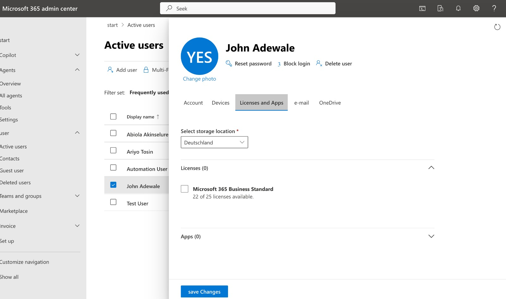
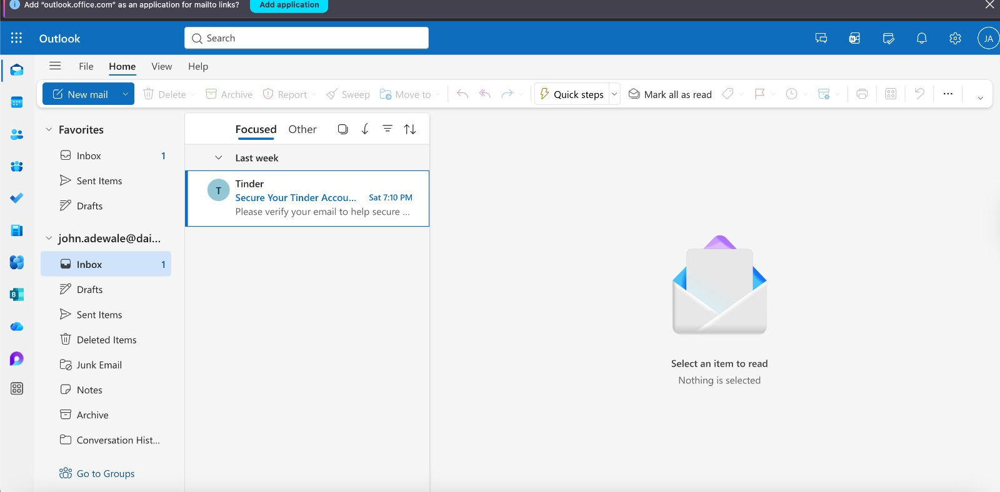
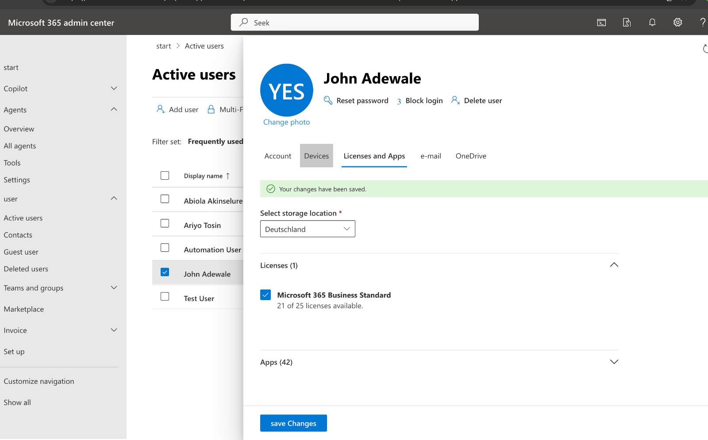

# **Microsoft 365 Identity & Mailbox Provisioning Issue — License Dependency**

## 🧾 Overview

I worked on a scenario where a user reported that they were unable to access Outlook and could not send or receive emails.

At first, this could easily be mistaken for an Outlook or application issue. Instead of jumping to conclusions, I approached it the way I would in a real support environment — by validating identity, licensing, and mailbox provisioning step by step.

---

## 🎫 Ticket Summary

**Title:** User unable to access Outlook and send emails
**Category:** Microsoft 365 / Exchange Online / Identity
**User:** John Adewale
**Priority:** High
**Status:** Resolved

**User Issue:**

> “I can’t access Outlook and I’m not able to send or receive emails.”

---

## 🔍 Investigation

Since the user reported both access and email issues, I started from the basics — identity and service availability.

---

### ✔ Initial Observation

* User unable to access Outlook Web
* Error message displayed when attempting login
* Email functionality unavailable

This suggested the issue could be related to **account provisioning or service assignment**, not just Outlook itself.

---

### ✔ License Verification

I checked the user account in the Microsoft 365 Admin Center.

* User account was active
* **No Microsoft 365 license assigned**

At this point, this was a strong indicator of the issue.

---

### ✔ Mailbox Verification

Since Exchange Online depends on licensing, I validated mailbox status:

* No mailbox was provisioned for the user
* Exchange service was not available

This confirmed that the issue was not Outlook — it was **lack of license → no mailbox → no email access**

---

## 🔎 Root Cause

The issue was caused by:

**No Microsoft 365 license assigned to the user**

Because of this:

* Exchange Online service was not enabled
* Mailbox was not created
* Outlook access failed
* User could not send or receive emails

---

## 🛠️ Resolution

To resolve the issue, I:

* Assigned a **Microsoft 365 Business Standard license** to the user
* Ensured Exchange Online service was included
* Allowed time for mailbox provisioning

After applying the license:

* Mailbox was automatically created
* Outlook access was restored
* Email sending and receiving functionality worked as expected

---

## 📸 Screenshots Included

* User account without license assigned

* Outlook access denied due to license no license assigned

* Outlook access restored after license assignment

* User account with license assignement

---

## 💡 Key Learning

This scenario reinforced a very important concept:

 **No license = No mailbox = No email access**

What looks like an Outlook issue is often actually a **service provisioning issue**.

---

## Real-World Insight

If a user says:

> “I can’t send or receive emails”

I now approach it like this:

1. Is the user licensed?
2. Does the mailbox exist?
3. Is Exchange Online enabled?
4. Can the user access Outlook?

---

## 🚀 Conclusion

This felt like a realistic support scenario — something that comes up frequently in Microsoft 365 environments, especially during onboarding or account setup.

More importantly, it helped me build the habit of checking **identity and service configuration first**, instead of assuming it’s an application issue.
