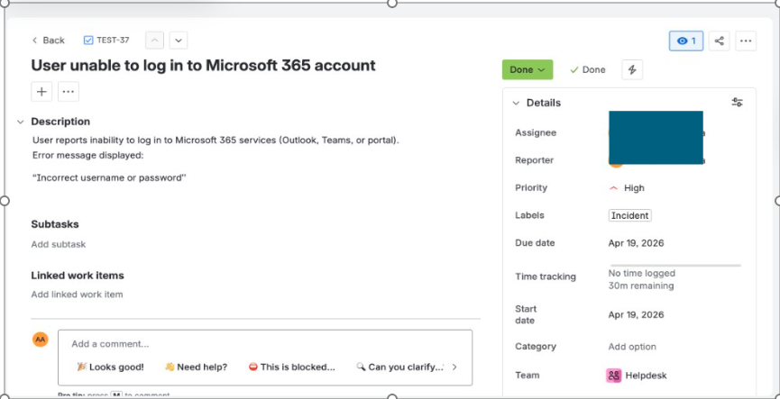
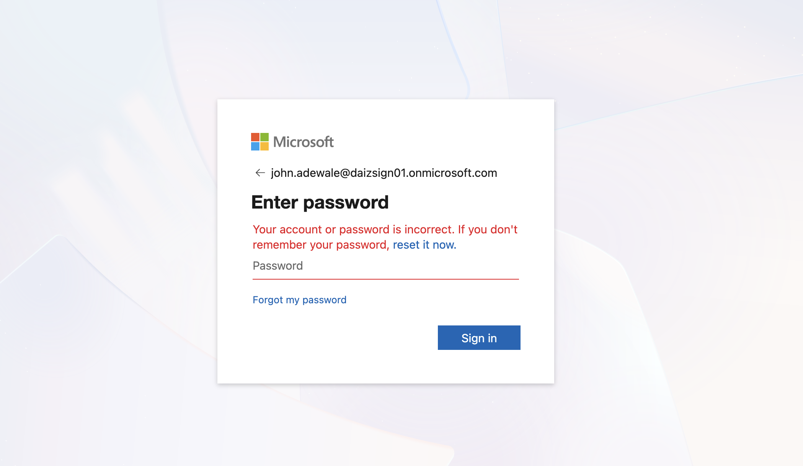
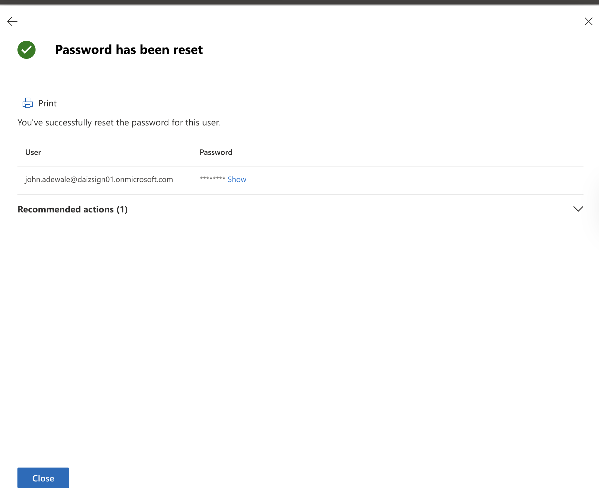
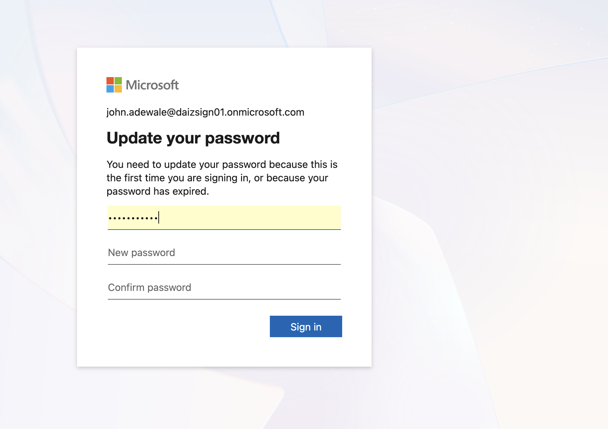
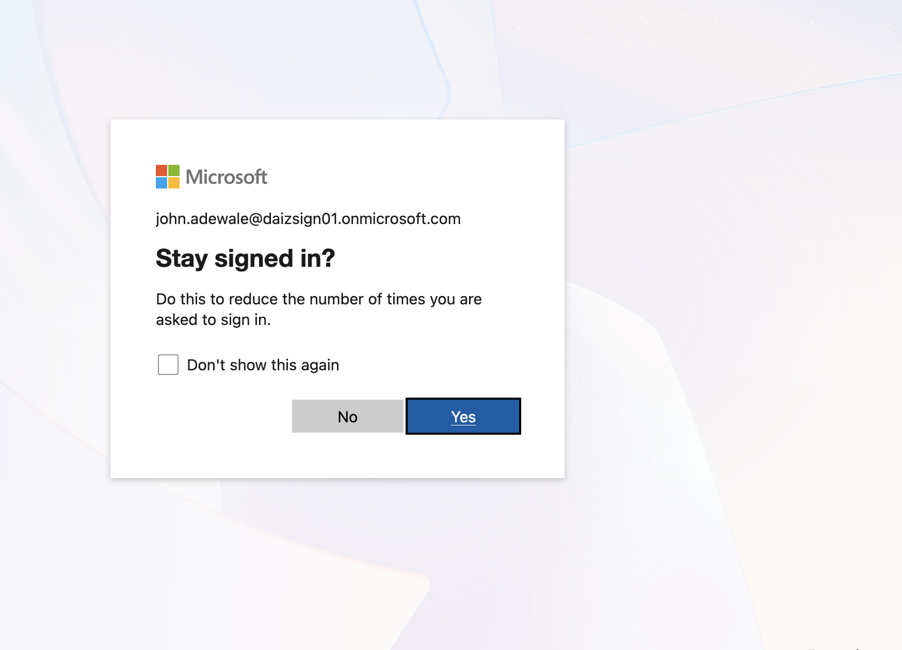
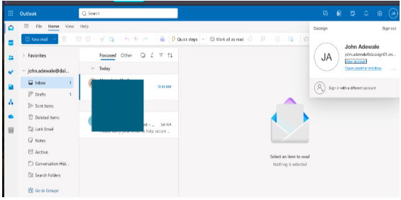

# Microsoft 365 – User Unable to Log In (Authentication Issue)

## Overview

In this lab, I handled a Microsoft 365 login issue to reflect a common real-world IT support scenario.

The objective was to work through a situation where a user is unable to access Microsoft 365 services due to an authentication failure, investigate the issue step-by-step, and restore access using standard administrative actions.

I approached this as a real support ticket — from initial user report to final resolution.

---

## Ticket Overview (Jira)

**Title:** User unable to log in to Microsoft 365 account  
**Type:** Incident  
**Priority:** High  
**SLA:** 4 hours  
**Original Estimate:** 30 minutes  
**Due Date:** Same business day  

**Reported Issue:**

User reports inability to log into Microsoft 365 services (Outlook, Teams, or portal).

Error message displayed:

> “Your account or password is incorrect”

**Impact:**

User is unable to access email and productivity tools, blocking daily work activities.

---

## Ticket Tracking (Jira)

To reflect a real support workflow, I documented and tracked this incident in a ticketing system (Jira).

The ticket was marked as **Resolved** after successful password reset and access restoration.

---

## Environment

- **Platform:** Microsoft 365 (Cloud Environment)  
- **User:** john.adewale@daizsign01.onmicrosoft.com  
- **Admin Tool:** Microsoft 365 Admin Center  
- **Service Tested:** Outlook Web (OWA)  

---

## Approach

- Recreated a user login failure scenario  
- Investigated whether the issue was user-side or system-side  
- Troubleshot authentication failure  
- Performed administrative password reset  
- Validated successful login  

---

## Step 1 – Issue Identification

The user attempted to log in but received the following error:

> “Your account or password is incorrect”

At this stage, the issue was confirmed as an authentication failure.

---

## Step 2 – Initial Analysis

Before taking action, I evaluated possible causes:

- Incorrect password entered by the user  
- Cached or outdated credentials  
- Recent password change  
- Account-related issue in Microsoft 365  

One key observation:

> Microsoft 365 does not enforce traditional lockout policies like on-prem Active Directory — it uses a smart lockout mechanism.

---

## Step 3 – Resolution (Password Reset)

To resolve the issue, I reset the user’s password via the Microsoft 365 Admin Center.

Actions performed:

- Generated a temporary password  
- Enforced password change at next login  

---

## Step 4 – Post-Reset Login Behavior

After the reset, the user attempted to log in again and was prompted:

> “You need to update your password”

---

## Step 5 – Password Update

The user successfully updated their password and completed authentication.

---

## Step 6 – Verification

User access was restored successfully.

✔ Authentication successful  
✔ Mailbox accessible  
✔ Issue resolved  

---

## Root Cause

The issue was caused by:

> Incorrect credentials entered by the user

The user likely attempted to log in using outdated or incorrect password details.

---

## Real-World Note

In enterprise environments, a similar issue can also occur due to:

> Password synchronization delays between on-premises Active Directory and Microsoft Entra ID

This typically happens in hybrid environments when:

- Password is reset in Active Directory  
- Sync to Microsoft 365 has not completed  

However, in this case:

> The issue was purely credential-related, not synchronization.

---

## Key Takeaways

- Microsoft 365 authentication behaves differently from traditional Active Directory  
- Login failures are not always system-related — user error is common  
- Structured troubleshooting helps isolate the root cause quickly  
- Password reset remains a reliable resolution step  
- Validation is essential to confirm full recovery  

---

## Conclusion

This exercise helped reinforce how authentication issues are handled in a cloud environment.

Rather than focusing on theory, I worked through the full support process:

- Identifying the issue  
- Investigating logically  
- Applying the fix  
- Confirming resolution  

This reflects the same approach used in real IT support environments.