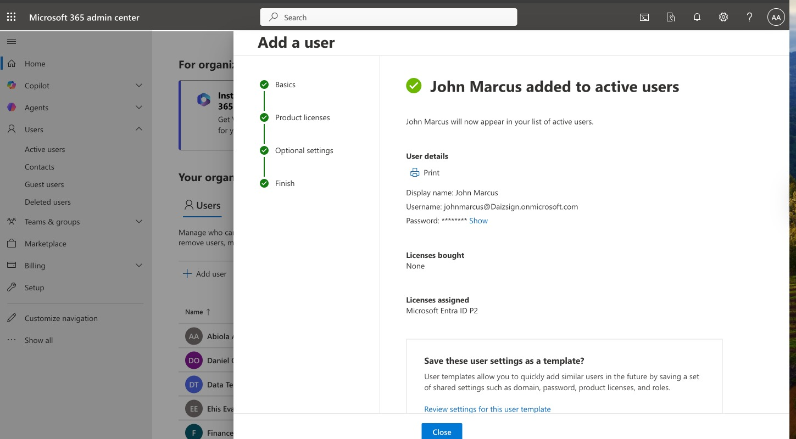
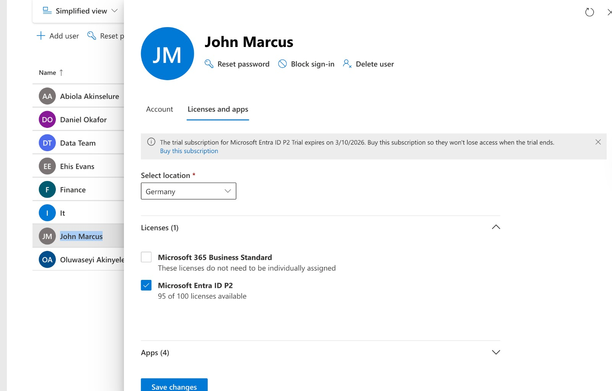
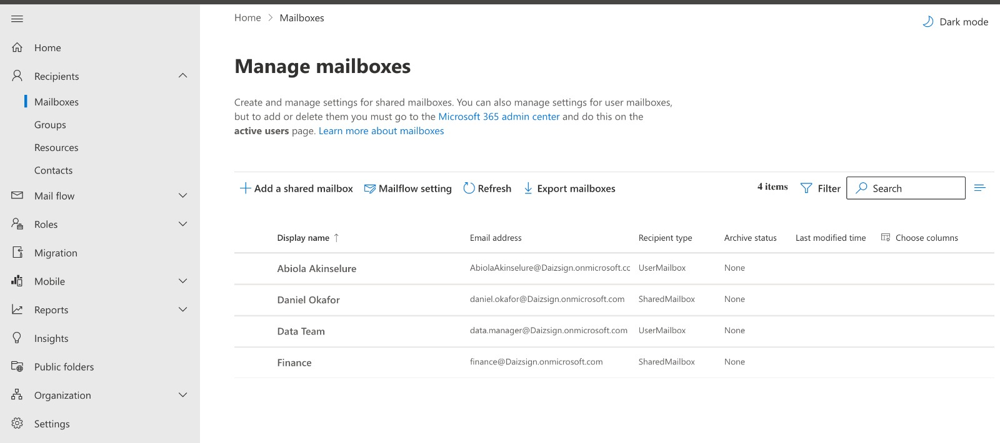
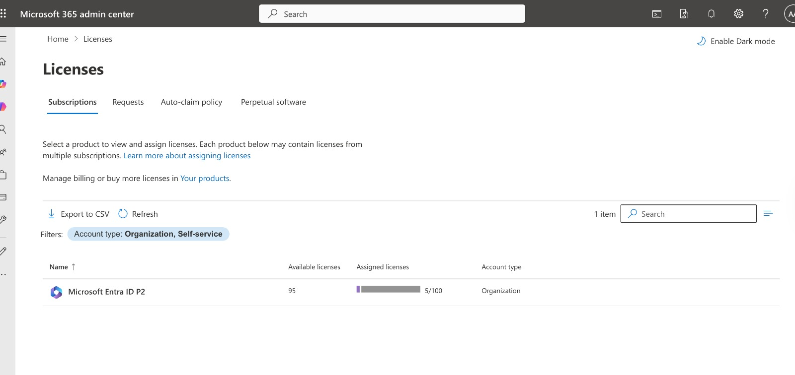

# 📧 Microsoft 365 User License Issue – Email Access Troubleshooting

This lab simulates a real-world IT support issue where a newly created user was unable to access email services in Microsoft 365.

The focus of this lab was to investigate the issue step by step, identify the root cause, and understand how licensing affects service availability.

---

## 🧠 Scenario

In this lab, I worked on a simulated support case where a new user account was created successfully in Microsoft 365.

However, the user reported:

> "I cannot access my email after login."

This is a common issue in Microsoft 365 environments and is often related to licensing or service configuration.

---

## 🔍 Investigation Process

I followed a structured troubleshooting approach, starting with account validation and moving toward licensing and service checks.

### Step 1 — Verify User Creation

I first confirmed that the user account was successfully created in the Microsoft 365 Admin Center.

This confirmed that the issue was not related to account provisioning.

---

### Step 2 — Check License Assignment

Next, I checked the user’s license configuration.

I observed that:

- Microsoft Entra ID P2 → Assigned  
- No Microsoft 365 service license available  

At this point, I suspected the issue might be related to missing service access.

---

### Step 3 — Attempt License Assignment

I attempted to assign a Microsoft 365 Business Standard license.

However, the assignment failed because there were no available licenses in the tenant.

---

### Step 4 — Verify Mailbox Availability

To confirm whether a mailbox had been provisioned, I checked the Exchange Admin Center.

Result:

No mailbox was found for the user.

This confirmed that the user did not have access to Exchange Online.

---

### Step 5 — Verify Tenant License Availability

Finally, I checked the tenant’s available licenses.

I confirmed that:

- Only Entra ID licenses were available  
- No Microsoft 365 service licenses (Exchange Online) were available  

This confirmed the root cause.

---

## 🧩 Key Findings

During the investigation, I observed the following:

- The user account was created successfully  
- Only an Entra ID license was assigned  
- No Microsoft 365 service license was available in the tenant  
- No mailbox was provisioned in Exchange Online  

These findings pointed to a licensing issue affecting service availability.

---

## 🧩 Root Cause

The issue was caused by the absence of a valid Microsoft 365 service license.

Although the user account was created successfully, only an Entra ID license was assigned, which does not include email services.

Because Exchange Online was not licensed, a mailbox was never provisioned.

---

## 🛠 Resolution

To resolve the issue in a real environment, a valid Microsoft 365 license (such as Business Standard or E3) would need to be assigned to the user.

This would trigger automatic mailbox provisioning in Exchange Online.

> Note: In this lab, the resolution could not be completed because no Microsoft 365 licenses were available in the tenant.

---

## ✅ Verification

Although a license could not be assigned in this lab, the investigation confirmed that the issue was caused by missing Exchange Online licensing.

In a real scenario, assigning a valid Microsoft 365 license would provision the mailbox and restore email access.

---

## 🎯 Outcome

The user was unable to access email because no Microsoft 365 service license was assigned.

This lab demonstrates how licensing directly affects service availability in Microsoft 365 environments.

---

## 💡 Key Learnings

This lab reinforced the importance of verifying licensing when troubleshooting access issues in Microsoft 365.

It also highlighted that creating a user account does not automatically grant access to services such as Exchange Online.

Many real-world issues are caused by simple configuration gaps, and checking licensing early can significantly reduce troubleshooting time.

---

## 🧑‍💻 Skills Demonstrated

- Investigated user access issues in a Microsoft 365 environment  
- Verified user account and licensing configuration  
- Identified missing service dependencies affecting email access  
- Validated mailbox provisioning status in Exchange Online  
- Diagnosed licensing-related issues at both user and tenant level  
- Applied structured troubleshooting to isolate the root cause  

---

## 🔥 Real-World Insight

This is a very common issue in IT support:

> “User cannot access email”

In many cases, the root cause is not complex, but related to missing or incorrect licensing.

Being able to quickly identify this helps reduce resolution time and improves user experience.

