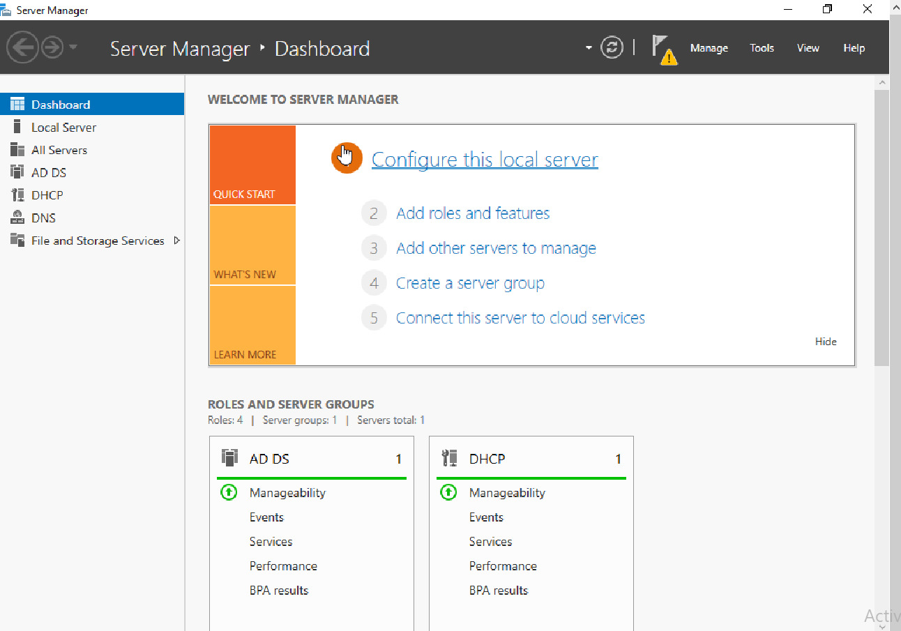
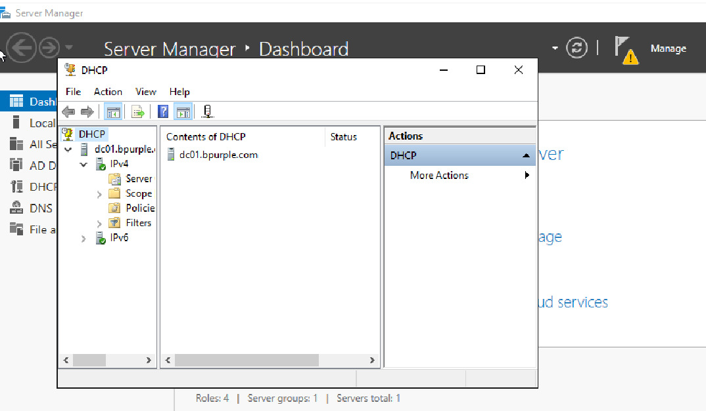
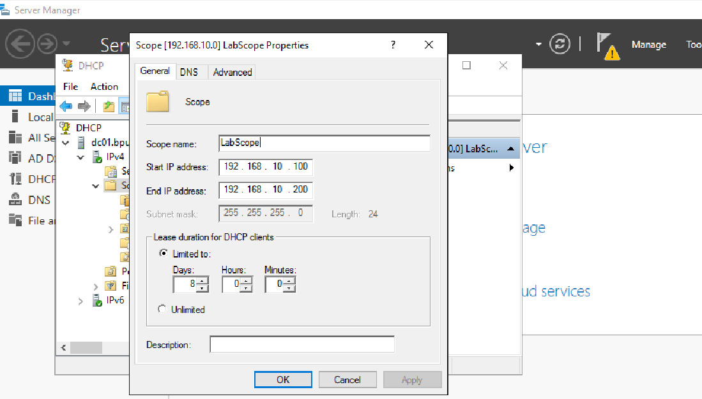
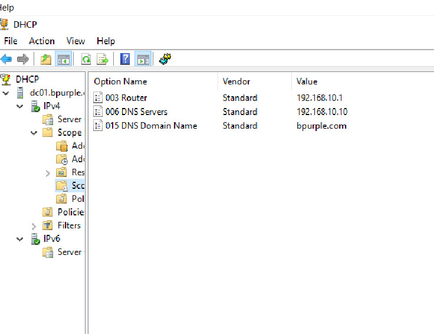
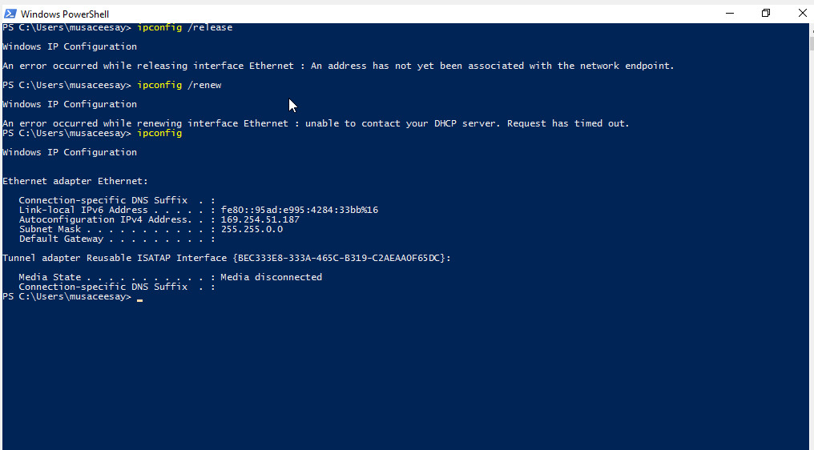
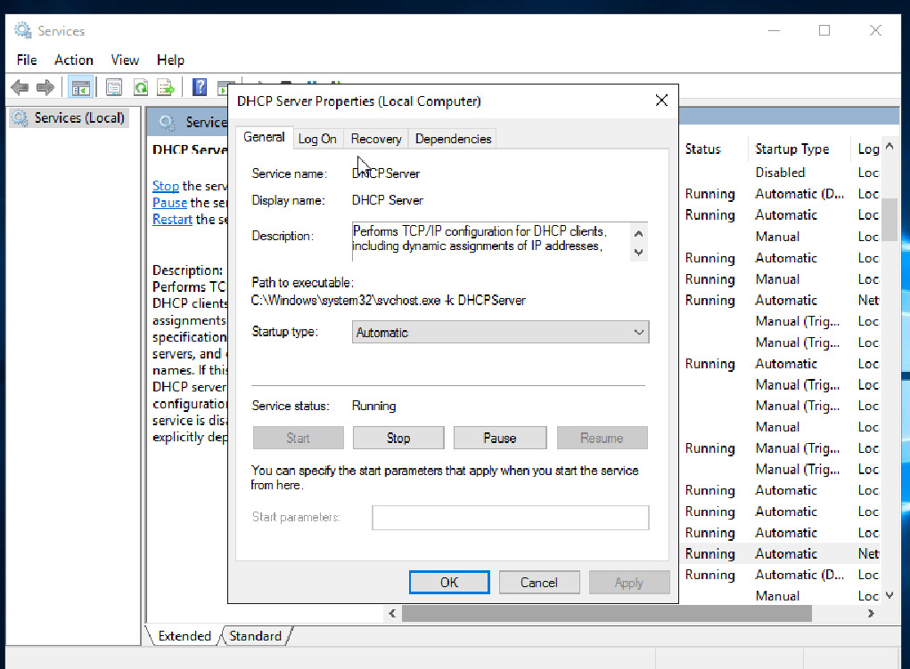
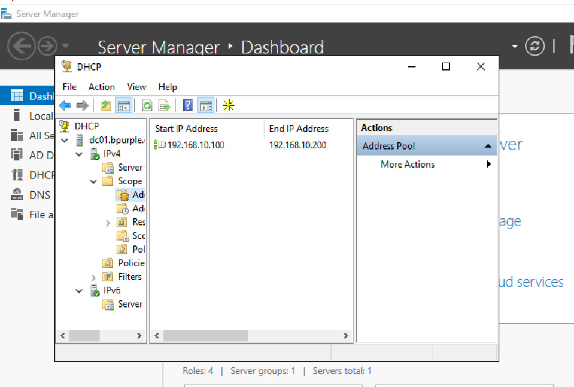
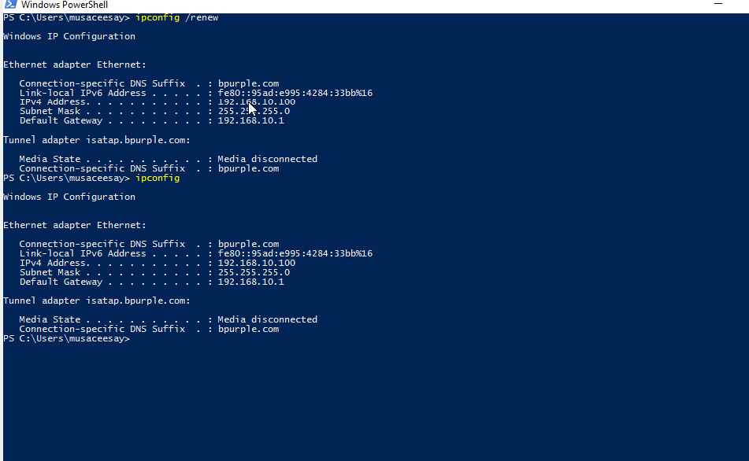
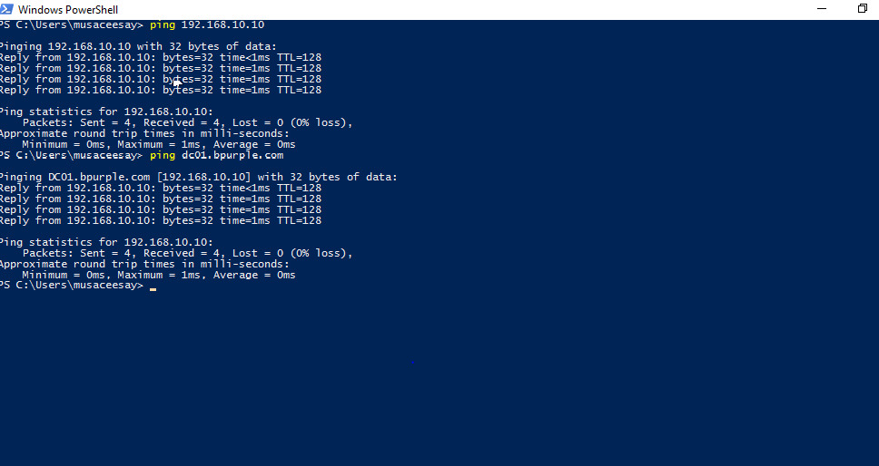

# 🔧 DHCP Configuration & Troubleshooting Lab (Real-World Scenario)

### Simulating Real-World IP Assignment and Network Validation in Windows Server

---

## 🎯 Objective

The goal of this lab was to configure a working DHCP server in a Windows Server environment and simulate a real-world scenario where a client fails to obtain an IP address.

Rather than just setting up DHCP, this lab focuses on:

* How DHCP works in an enterprise network  
* How to troubleshoot IP assignment issues  
* How DHCP integrates with Active Directory and DNS  

This lab also demonstrates a structured, support-style approach to identifying and resolving DHCP-related issues in a controlled environment.

---

🧾 Incident Summary

| Field      | Details                                 |
| ---------- | --------------------------------------- |
| Ticket ID  | DHCP-001                                |
| Category   | Network / DHCP                          |
| Priority   | Medium (P2)                             |
| Issue      | Client unable to obtain IP address      |
| Impact     | User unable to access network resources |
| Status     | Resolved                                |

---

## 🧾 Scenario (Real-World Context)

A user reports:

> “My system is connected to the network, but I’m not getting an IP address.”

This is a common issue in enterprise environments and can affect:

* Network access
* Domain login
* Internet connectivity

---

## 🖥️ Lab Environment

| System   | Role                           | IP Address     |
| -------- | ------------------------------ | -------------- |
| DC01     | Domain Controller + DHCP + DNS | 192.168.10.10  |
| CLIENT01 | Domain-joined Windows Client   | DHCP (dynamic) |

**Network:**
`192.168.10.0/24`

---

## ⚙️ DHCP Configuration Overview

The DHCP server was configured with the following settings:

* **Scope Name:** LabScope
* **IP Range:** 192.168.10.100 – 192.168.10.200
* **Subnet Mask:** 255.255.255.0
* **Default Gateway:** 192.168.10.1
* **DNS Server:** 192.168.10.10
* **Domain Name:** bpurple.com

---

## 🛠️ Implementation Steps

### ✅ 1. Installed DHCP Role

* Opened **Server Manager**
* Added **DHCP Server role**
* Completed post-install configuration



---

### ✅ 2. Authorized DHCP Server

* Authorized the server in Active Directory
* Ensured only trusted DHCP servers can assign IP addresses



---

### ✅ 3. Created and Configured DHCP Scope

* Defined IP range for clients
* Configured subnet mask
* Activated the scope



---

### ✅ 4. Configured DHCP Options (Critical Step)

Configured:

* **003 Router (Gateway):** 192.168.10.1
* **006 DNS Server:** 192.168.10.10
* **015 Domain Name:** bpurple.com



---

## 🚨 Incident Simulation

To simulate a real support issue:

* The client was switched from static IP to DHCP
* Attempted to release and renew IP

```bash
ipconfig /release
ipconfig /renew
```

---

## ❗ Observed Issue

* Client failed to obtain IP address initially
* Error:

  > “An address has not yet been associated with the network endpoint”



---

## 🔍 Troubleshooting Approach

A structured, step-by-step approach was used.

---

### 🔎 Step 1 — Verify Client IP Configuration

```bash
ipconfig
```

**Observation:**

* No valid IP or incorrect configuration


---

### 🔎 Step 2 — Verify DHCP Service

On DC01:

* DHCP service → **Running**
* Server → **Authorized**



---

### 🔎 Step 3 — Verify DHCP Scope

* Scope configured correctly
* Scope activated
* Address pool verified (IP range visible)



---

### 🔎 Step 4 — Renew DHCP Lease

```bash
ipconfig /renew
```

**Result:**

* Client successfully received IP from DHCP


---

## 💡 Root Cause

The issue occurred after switching the client from a static IP to DHCP.

At that moment, the client had no valid IP address and was unable to communicate properly with the DHCP server, which caused the lease request to fail initially.

Once the DHCP process was retriggered, the client was able to successfully obtain an IP address from the configured scope.

---

## ✅ Resolution

* Ensured client was set to:

  * Obtain IP automatically
  * Obtain DNS automatically
* Renewed DHCP lease
* Verified DHCP scope and options

---

## 🧪 Validation & Testing

### ✅ IP Assignment

```bash
ipconfig
```

✔ IP assigned: `192.168.10.100`
✔ Subnet correct
✔ DNS suffix applied



---

### ✅ Connectivity Tests

```bash
ping 192.168.10.10
ping dc01.bpurple.com
```

✔ Successful — confirms:

* Network connectivity
* DNS resolution



---

### ⚠️ Gateway Test

```bash
ping 192.168.10.1
```

❌ Result: Destination host unreachable


---

## 🧠 Explanation (Important Insight)

The gateway was configured in DHCP, but:

> There is no actual router device in this lab environment using `192.168.10.1`

This means:

* Internal communication works ✅
* External routing is not available ❌

This is expected behavior in a lab setup.

---

## 🧠 Key Takeaways

* DHCP automates IP configuration in enterprise networks
* DNS must point to the Domain Controller in AD environments
* DHCP options (gateway, DNS) are critical for functionality
* A client without a valid lease cannot communicate properly
* Not all “errors” are misconfigurations — some are environment limitations

---

## 🔧 Skills Demonstrated

* DHCP installation and configuration
* Scope creation and management
* DHCP authorization in Active Directory
* Network troubleshooting
* Client connectivity diagnostics
* Understanding of real vs lab environments

---

## 💼 Real-World Relevance

In production environments, DHCP issues can:

* Prevent users from accessing the network
* Block domain authentication
* Cause widespread outages

Being able to:

* Diagnose DHCP issues
* Validate configurations
* Understand network behavior

…is a key skill for IT Support and System Administration roles.

---

## 🚀 Final Reflection

This lab was not just about configuring DHCP.

It was about:

* Thinking like a support engineer
* Investigating issues step by step
* Understanding how systems interact

---

## 🧠 What I Would Do in a Real Environment

In a production environment, I would also:

* Check DHCP logs for lease activity
* Verify no IP conflicts exist in the scope
* Confirm network adapter and VLAN configuration
* Escalate if multiple clients are affected

This ensures the issue is not part of a larger network problem.

