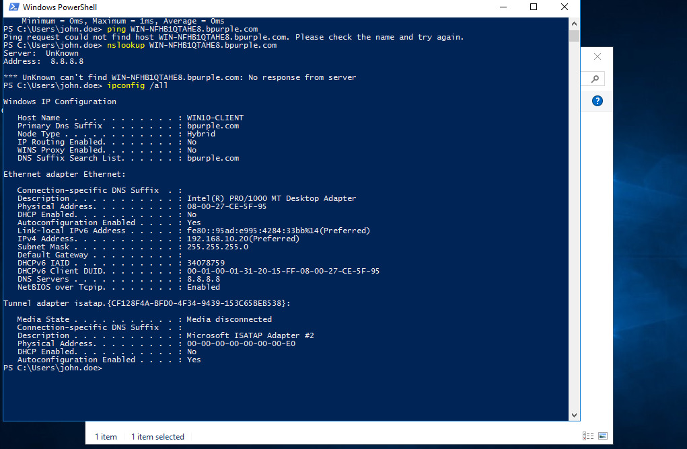
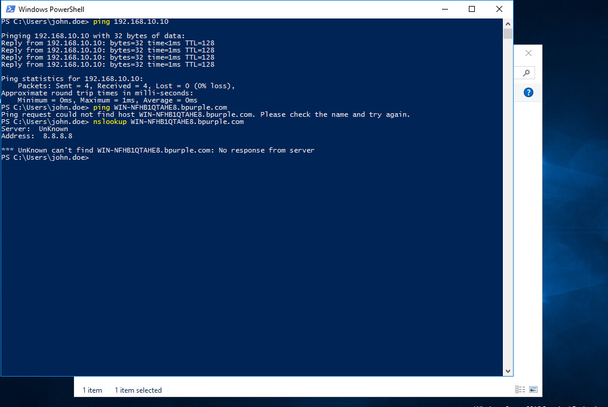

# DNS Resolution Failure - Active Directory Lab

## Ticket Information

- **Category:** Networking / Active Directory / DNS  
- **Priority:** P2 – High  
- **Impact:** User unable to access domain resources via hostname  
- **SLA Target:** 4 hours  
- **Resolution Time:** 45 minutes
- **Status:** Resolved  

---

## Incident Overview

A user reported inability to access internal resources using the server hostname, while direct IP connectivity was successful.

“I can ping the server IP, but not the server name.”

This indicated a likely DNS resolution issue within the Active Directory environment.

---

## Lab Environment

- **Domain:** bpurple.com  
- **Domain Controller:** DC01 (192.168.10.10)  
- **Client Machine:** CLIENT01 (192.168.10.20)    
- **DNS Server:** 192.168.10.10
- **Virtualization:** VirtualBox (Internal Network + NAT) 

---

## Network Architecture


---

## Initial Symptoms

On CLIENT01:

```bash
ping 192.168.10.10        # Success
ping dc01.bpurple.com     # Failed
nslookup dc01             # Failed
```

Network connectivity was working, but DNS resolution was failing.

---

---

## Investigation Process

### Step 1 — Confirm Network Connectivity

```bash
ping 192.168.10.10
```

✅ Result: Successful → Network is reachable

---

### Step 2 — Test DNS Resolution

```bash
nslookup dc01.bpurple.com
```

❌ Result: Failed → DNS issue suspected

```
*** can't find dc01: Non-existent domain
```

---

### Step 3 — Validate DNS Configuration

```bash
ipconfig /all
```

Observed:

```
DNS Servers . . . . . . . : 8.8.8.8
```

📌 External DNS detected

---

## 🧠 Root Cause

The client machine was configured to use:

```
8.8.8.8 (External DNS)
```

Instead of:

```
192.168.10.10 (Internal Domain Controller)
```

External DNS cannot resolve internal Active Directory records.

---

## 🛠️ Resolution Steps

1. Open Network Settings:

```bash
ncpa.cpl
```

2. Navigate to Adapter → Properties  
3. IPv4 settings  
4. Update DNS server to preferred DNS:

```
192.168.10.10
```

5. Flush DNS Cache:

```bash
ipconfig /flushdns
```

---

## Evidence — Issue Identification

### ❌ DNS Misconfiguration


### ❌ Failed Resolution


## 📸 Evidence — Resolution & Validation

### ✅ DNS Fixed


### ✅ Successful Resolution


---

## ✅ Verification

- Hostname resolution successful  
- Ping via hostname successful  
- Domain resources accessible:

```
\\DC01\Finance-Share
```

- User confirmed issue resolved  

---

## Business Impact

If unresolved, this issue could result in:
- Domain authentication failure
- Group Policy processing issues
- Inaccessible shared resources (e.g file shares)
- Applications failures due to hostname resolution issues

## Skills Demonstrated

- DNS troubleshooting in Active Directory 
- Network vs DNS issue isolation  
- Command-line diagnostics (ping, nslookup, ipconfig)
- Root cause analysis  
- Structured troubleshooting approach

---

## Key Takeaway

Active Directory environments rely heavily on internal DNS infrastructure.

Using external DNS (e.g., 8.8.8.8) will break:
- Authentication  
- Domain communication
- Resource access  

---

## Conclusion

The issue was caused by incorrect DNS configuration on the client machine, where an external DNS server was used instead of the internal domain controller.

Updating the DNS settings to point to the domain controller restored proper name resolution and full access to domain resources.

This scenario highlights the critical role of DNS in Active Directory environments, where misconfiguration can directly impact authentication, Group Policy processing, and access to shared resources.