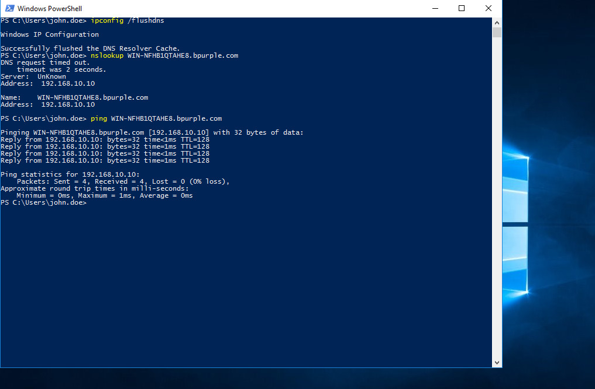
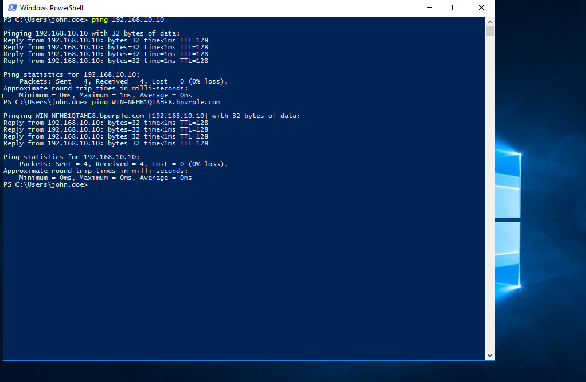

# DNS Resolution Failure in Active Directory (Real-World IT Support Scenario)

This lab simulates a real-world IT support scenario where a DNS misconfiguration prevents hostname resolution in an Active Directory environment.

## Ticket Information

- **Category:** Networking / Active Directory / DNS  
- **Priority:** P2 – High  
- **Impact:** Single user unable to access domain resources  
- **SLA Target:** 4 hours  
- **Resolution Time:** 45 minutes (within SLA)  
- **Status:** Resolved  

---

## Scenario

**User Reported:**

> “I can ping the server IP but not the server name.”

The user was unable to access internal resources using hostname, but confirmed that the server IP address was reachable.

---

## Environment

- **Domain:** bpurple.com  
- **Domain Controller:** DC01 (192.168.10.10)  
- **Client Machine:** CLIENT01 (Domain-joined)  
- **Virtualization:** VirtualBox (Internal Network + NAT)  
- **DNS Server:** 192.168.10.10  

---

## Network Architecture


---

## Initial Symptoms

On CLIENT01:

```bash
ping 192.168.10.10        # Successful
ping dc01.bpurple.com     # Failed
nslookup dc01             # Failed
```

Network connectivity was confirmed, but hostname resolution was not functioning.

---

## Evidence — Issue Identification

### ❌ Hostname Resolution Failure


### ❌ Incorrect DNS Configuration


---

## Business Impact

- Domain authentication may fail  
- Group Policy processing may break  
- File shares may become inaccessible  
- Applications relying on hostname resolution may fail  

---

## Investigation Steps

### Step 1 — Validate Network Connectivity

```bash
ping 192.168.10.10
```

✅ Result: Successful  

---

### Step 2 — Test DNS Resolution

```bash
nslookup dc01.bpurple.com
```

❌ Result:

```
*** can't find dc01: Non-existent domain
```

---

### Step 3 — Inspect DNS Configuration

```bash
ipconfig /all
```

Observed:

```
DNS Servers . . . . . . . : 8.8.8.8
```

📌 External DNS detected

---

## 🧠 Root Cause

CLIENT01 was using:

```
8.8.8.8 (External DNS)
```

Instead of:

```
192.168.10.10 (Domain Controller)
```

External DNS cannot resolve internal AD records.

---

## 🛠️ Resolution Steps

1. Open:

```bash
ncpa.cpl
```

2. Go to Adapter → Properties  
3. Edit IPv4 settings  
4. Set DNS to:

```
192.168.10.10
```

5. Flush DNS:

```bash
ipconfig /flushdns
```

---

## 📸 Evidence — Resolution & Validation

### ✅ DNS Fixed


### ✅ Successful Resolution


---

## ✅ Verification

- Hostname resolution successful  
- Ping to domain name successful  
- Shared folder accessible:

```
\\DC01\Finance-Share
```

- User confirmed issue resolved  

---

## Skills Demonstrated

- DNS troubleshooting (Active Directory)  
- Network vs DNS issue isolation  
- Command-line diagnostics  
- Root cause analysis  
- Structured troubleshooting  

---

## Key Takeaway

Active Directory relies heavily on **internal DNS**.

Using external DNS will break:
- Authentication  
- Group Policy  
- Resource access  

---

## Conclusion

The issue was caused by incorrect DNS configuration.  
Updating the DNS server to the domain controller restored full functionality.
This issue demonstrates the importance of proper DNS configuration in Active Directory environments and reflects a common real-world L1/L2 support scenario.
