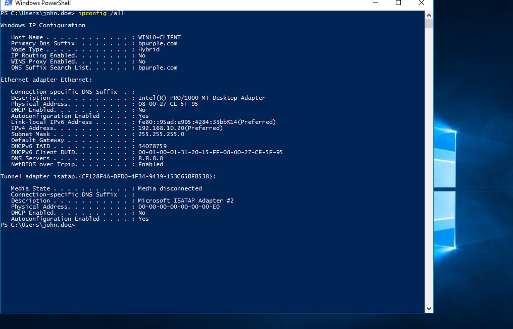
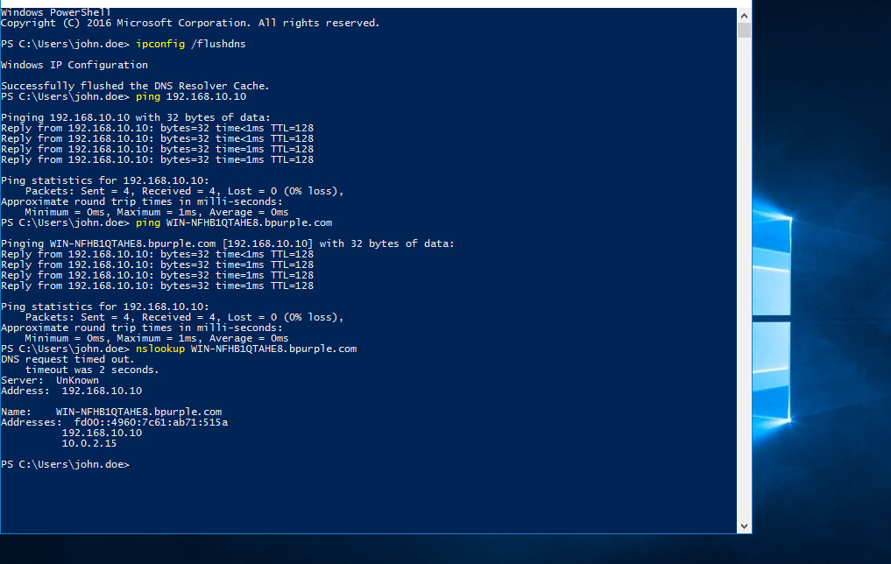

# 🔧 VPN Connected but No Access to Shared Drives – Troubleshooting Lab

## Ticket Information

- **Category:** Networking / VPN / Active Directory  
- **Priority:** P2 – High  
- **Impact:** Remote user unable to access internal shared resources  
- **SLA Target:** 4 hours  
- **Resolution Time:** 1 hour (within SLA)  
- **Status:** Resolved  

---

## Scenario

In this lab, I worked on a simulated support case where a remote user reported:

> “VPN connects but I can’t access shared drives.”

Although the VPN client showed as connected, the user was unable to access internal resources such as:

\\DC01\Finance-Share  

This suggested that the issue was not with the VPN connection itself, but with internal network access.

---

## Environment

- **Domain:** bpurple.com  
- **Domain Controller:** DC01 (192.168.10.10)  
- **Client Machine:** Domain-joined Windows 11  
- **VPN Type:** Remote Access VPN  
- **Internal Network:** 192.168.10.0/24  
- **Virtualization:** VirtualBox (Internal Network + NAT)  
- **DNS Server:** 192.168.10.10  

---

## Initial Symptoms

After connecting to the VPN, I tested connectivity:

ping 192.168.10.10  
ping dc01.bpurple.com  

Result:

Request timed out  

Attempting to access:

\\DC01\Finance-Share  

Result:

Network path not found  

This confirmed that although the VPN showed as connected, the client could not reach internal resources.

---

## Evidence — Issue Identification

### ❌ VPN Connectivity Failure

### ❌ Incorrect DNS Configuration

---

## Business Impact

- Remote productivity disrupted  
- Business files inaccessible  
- Collaboration delayed  
- Increased dependency on IT support  

This issue directly impacted remote operations.

---

## 🔍 Investigation Process

I followed a structured troubleshooting approach, starting with VPN validation and then checking connectivity and DNS configuration.

## Investigation Steps

### Step 1 — Validate VPN Connection

I confirmed VPN client status:

    Connected

Verified that the client received a VPN-assigned IP address.

---

### Step 2 — Test Internal Network Connectivity

This indicated that the issue was not just DNS-related, but also affecting basic connectivity to the internal network.

I executed:

    ping 192.168.10.10

Result:

    Request timed out

This indicated internal routing or DNS issues over VPN.

---

### Step 3 — Test DNS Resolution

Since hostname resolution also failed, I suspected a DNS configuration issue on the VPN client.

I executed:

    ping dc01.bpurple.com

Result:

    Request timed out

Hostname resolution failed.

---

### Step 4 — Inspect DNS Configuration

I executed:

    ipconfig /all

Observed:

    DNS Servers . . . . . . . : 8.8.8.8

This indicated that external DNS was detected (incorrect for domain environment).

---

## 🧠 Root Cause

The VPN connection was successfully established, but the client was using an external DNS server (8.8.8.8) instead of the internal domain DNS.

Because of this:

- Internal hostnames could not be resolved  
- Domain resources were unreachable  
- Shared drives could not be accessed  

This confirmed that the issue was related to DNS configuration, not the VPN connection itself.

---

## 🛠 Resolution

To resolve the issue, I updated the DNS settings on the VPN adapter to use the domain controller:

192.168.10.10  

After reconnecting the VPN, I flushed the DNS cache:

ipconfig /flushdns  

I then retested connectivity.

---

## Evidence — Resolution

### ✅ DNS Fixed

### ✅ Successful Connectivity

---

## Additional Observation

### ⚠️ Access Denied (Permission Issue)

After DNS fix:

- Network connectivity: ✅  
- DNS resolution: ✅  
- Access issue: ❌ (permissions related)

This confirms the VPN/DNS issue was resolved and a separate permissions issue remained.

---

## ✅ Verification

After applying the fix:

- VPN connection remained active  
- Internal server was reachable via IP  
- Hostname resolution was successful  
- Shared drives became accessible  

This confirmed that the issue was resolved and remote access was restored.

---

## 🔎 Additional Observation

After fixing the DNS issue, I noticed that access to the shared folder returned an “Access Denied” error.

This indicated that:

- Network connectivity was restored  
- DNS resolution was working  
- The remaining issue was related to permissions  

This helped separate network issues from access control issues during troubleshooting.

---

## 💼 Business Impact

In a real environment, this issue would prevent remote users from accessing internal resources such as shared drives.

This could delay work, disrupt collaboration, and increase support requests, especially for teams relying on VPN access.

---

## 🧑‍💻 Skills Demonstrated

- Diagnosed VPN connectivity issues in a domain environment  
- Identified DNS misconfiguration affecting remote access  
- Differentiated between network, DNS, and permission-related issues  
- Used command-line tools to validate connectivity and resolution  
- Restored access by correcting DNS configuration  
- Applied structured troubleshooting to isolate and resolve the issue  

---

## 🧠 Key Takeaway

This lab showed that a VPN connection showing “Connected” does not guarantee access to internal resources.

Proper troubleshooting requires checking connectivity, DNS resolution, and access permissions step by step.

---

## Conclusion

The issue was caused by incorrect DNS configuration on the VPN client.

Updating the DNS server to the domain controller restored connectivity and access to internal resources.

This reflects a common real-world IT support scenario where DNS plays a critical role in VPN and Active Directory environments.