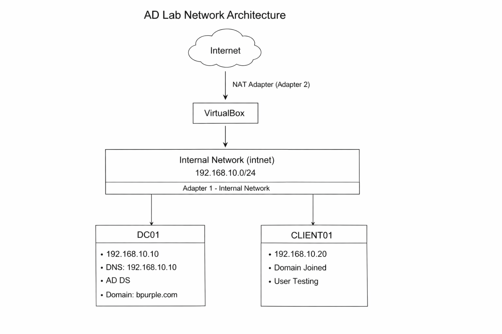
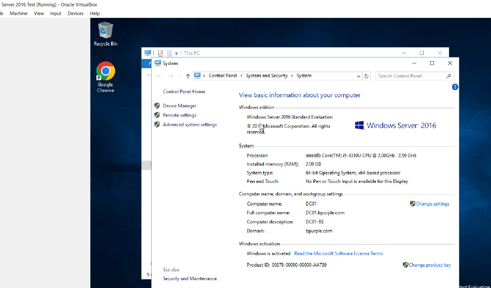
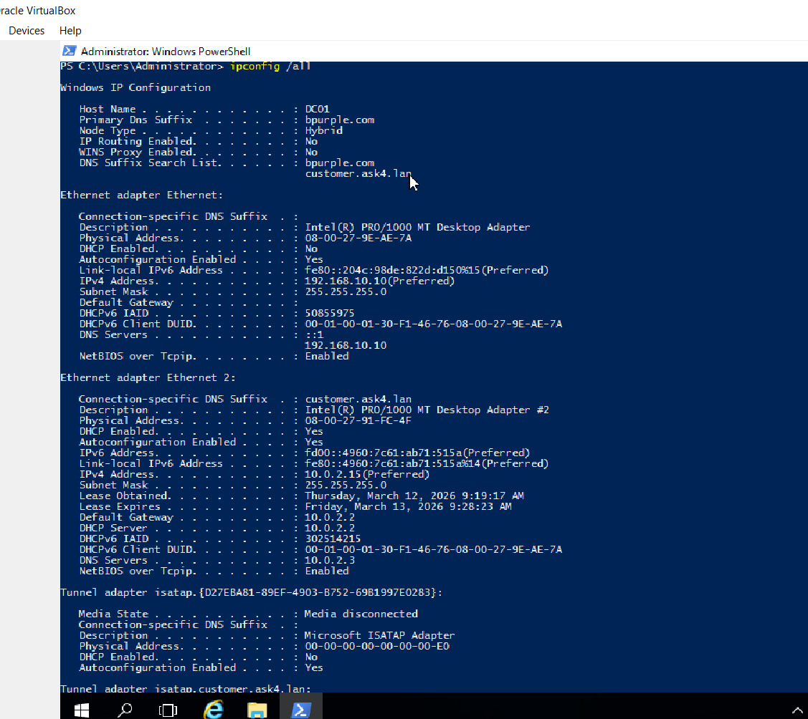
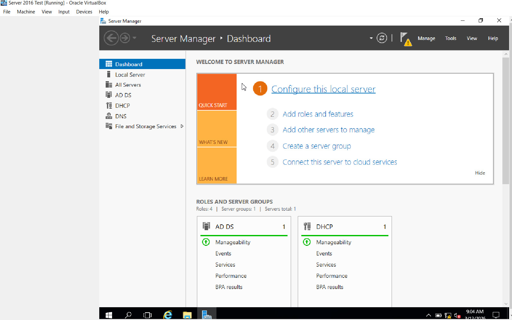
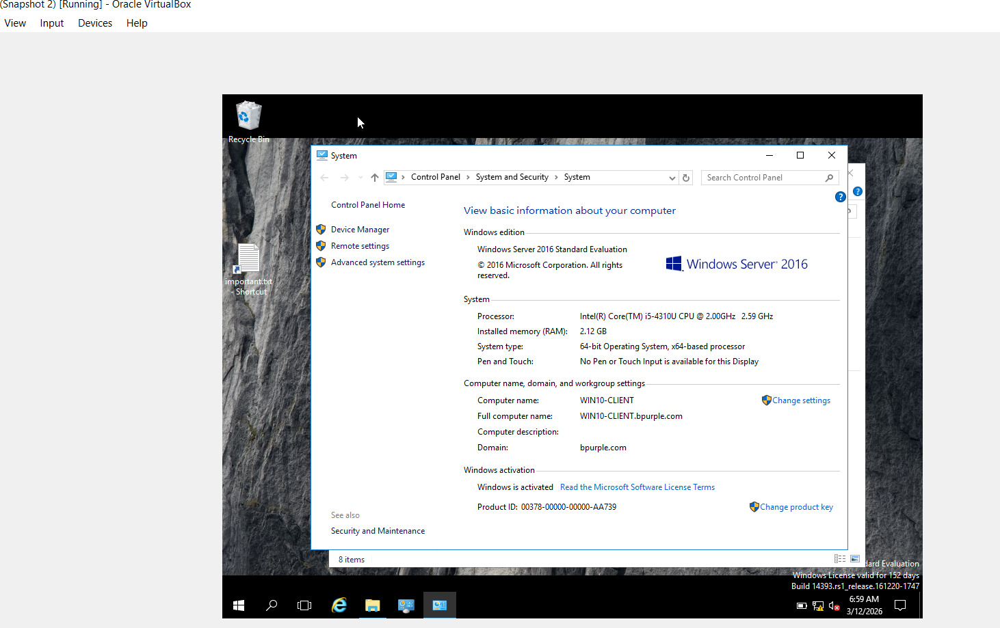
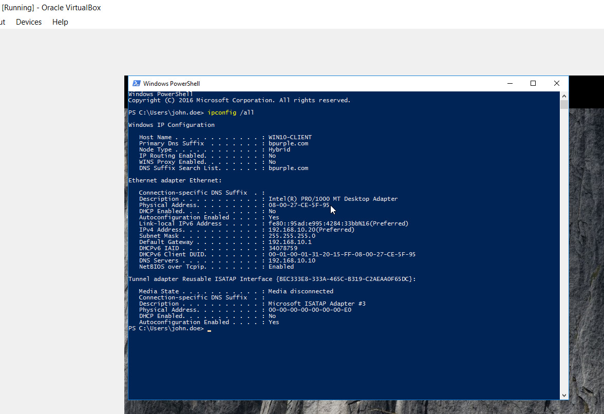
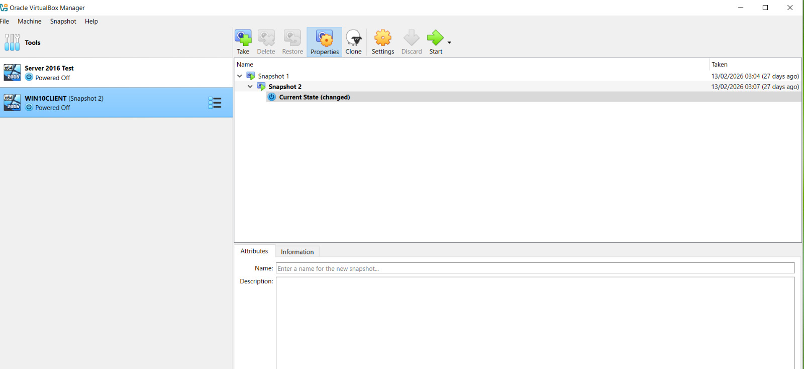

# Windows Server Deployment – Active Directory Infrastructure Setup

## Ticket Information

- **Category:** Windows Infrastructure / Server Deployment  
- **Priority:** P2 – High  
- **Impact:** Infrastructure setup required for Active Directory lab environment  
- **SLA Target:** 1 Business Day  
- **Resolution Time:** 2 hours  
- **Status:** Completed  

---

# Scenario

**Task Assigned**

> Deploy a Windows Server infrastructure to support an Active Directory lab environment.

The objective of this task was to deploy a Windows Server environment capable of supporting enterprise identity and authentication services.

The server needed to be configured with:

- Static IP configuration
- Server identity configuration
- Active Directory Domain Services
- DNS services
- Domain Controller promotion

A Windows client machine would later join the domain to validate authentication and network communication.

---

# Environment

- **Domain:** bpurple.com  
- **Domain Controller:** DC01 (192.168.10.10)  
- **Client Machine:** CLIENT01 (192.168.10.20)  
- **Server OS:** Windows Server 2016 Standard  
- **Client OS:** Windows 10  
- **Virtualization Platform:** Oracle VirtualBox  
- **Network Type:** Internal Network (intnet)  
- **Network Range:** 192.168.10.0 / 24  

---

# Network Architecture

The lab environment consists of a Windows Server Domain Controller and a Windows client machine connected through a VirtualBox internal network.

---

# Infrastructure Overview

The virtual lab environment consists of two machines running inside VirtualBox.

### Domain Controller

DC01  
Windows Server 2016  
192.168.10.10  
Roles: AD DS / DNS  
Domain: bpurple.com  

Responsibilities:

- Active Directory authentication
- DNS resolution
- Directory management

---

### Client Machine

CLIENT01  
Windows 10  
Domain Joined  

Responsibilities:

- Domain authentication
- User login testing
- Network communication validation

---

# Server Deployment

## Windows Server Installation

A Windows Server 2016 virtual machine was created using Oracle VirtualBox.

The **Desktop Experience edition** was selected to allow graphical server management.

---

## Server Identity Configuration

The server hostname was configured using enterprise naming standards.

Computer Name: DC01  
Domain: bpurple.com  

This naming convention is commonly used in enterprise infrastructure environments where domain controllers follow the format:

DC01  
DC02  

---

# Static IP Configuration

Infrastructure servers must use static IP addresses to ensure reliable service availability.

IP Address: 192.168.10.10  
Subnet Mask: 255.255.255.0  
Default Gateway: 192.168.10.1  
DNS Server: 192.168.10.10  

Configuration validation command:

ipconfig /all

---

# Server Roles

The server was prepared to host infrastructure services.

Roles installed:

Active Directory Domain Services  
DNS Server  

These services provide:

- Domain authentication
- Directory services
- Name resolution for domain resources

---

# Active Directory Domain Deployment

The server was promoted to a **Domain Controller** for the domain:

bpurple.com

This process installed and configured:

- Active Directory Domain Services
- DNS integration
- Domain authentication infrastructure

After promotion, the server became the primary authentication authority for the lab environment.

---

# Client Machine Deployment

A Windows 10 client machine was deployed within the same internal network.

IP Address: 192.168.10.20  
DNS Server: 192.168.10.10  

The client machine was then joined to the domain:

bpurple.com

---

# Client IP Configuration

Host Name . . . . . . . . : CLIENT01
Primary DNS Suffix . . . : bpurple.com

IPv4 Address . . . . . . : 192.168.10.20
Subnet Mask . . . . . .  : 255.255.255.0
Default Gateway . . . .  : 192.168.10.1

DNS Servers . . . . . .  : 192.168.10.10

Configuration validation command:

ipconfig /all

---

# Domain Authentication Validation

A domain user account was created in Active Directory.

Example user:

bpurple\john

The user successfully authenticated from CLIENT01.

This confirmed:

- DNS resolution working
- Domain controller communication
- Active Directory authentication functional

---

# Verification

Server validation:

DC01.bpurple.com  
192.168.10.10  
Active Directory operational  
DNS operational  

Client validation:

CLIENT01 domain joined  
Domain login successful  
DNS resolution successful  

Connectivity test:

ping dc01.bpurple.com

Result:

Reply from 192.168.10.10

---

# Evidence — Lab Screenshots

### Virtual Lab Environment

---

### Server System Properties

---

### Static IP Configuration

---

### Server Manager Roles

---

### Client Domain Join

---

# Business Impact

Deploying this infrastructure enables the lab environment to simulate real enterprise scenarios including:

- Active Directory identity management
- DNS resolution troubleshooting
- User authentication
- Access control
- Group policy deployment
- Network service diagnostics

---

# Skills Demonstrated

- Windows Server deployment
- Virtual infrastructure setup
- Static IP configuration
- Active Directory domain configuration
- DNS infrastructure deployment
- Domain client integration
- Enterprise network architecture
- Infrastructure documentation

---

# Key Takeaway

Before troubleshooting identity or networking issues in enterprise environments, a properly configured infrastructure must exist.

Deploying a Windows Server environment with Active Directory and DNS provides the foundation for:

- Identity management
- Authentication services
- Network service management
- Enterprise IT operations

---

# Conclusion

A Windows Server infrastructure was successfully deployed and configured as the Domain Controller for the **bpurple.com** environment.

The server now provides directory services, DNS resolution, and authentication capabilities for domain clients.

This lab forms the foundational infrastructure required for future scenarios involving:

- Active Directory troubleshooting
- Access control management
- Group Policy configuration
- DNS and DHCP diagnostics

This deployment reflects a **real-world infrastructure setup commonly implemented by system administrators and IT support engineers.**
