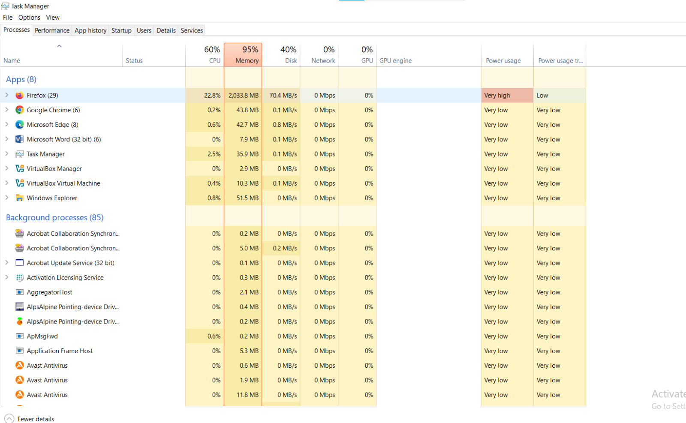
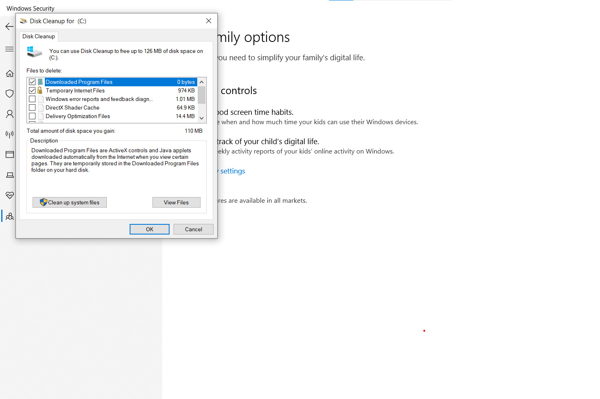

# Malware Detected — Scan, Containment & Removal

## Ticket Information

- **Category:** Windows / Security / Incident Response
- **Priority:** P2 – High
- **Impact:** Single workstation infected with Potentially Unwanted Program (PUP)
- **SLA Target:** 4 hours
- **Resolution Time:** 1 hour 30 minutes
- **Status:** Resolved

---

## Scenario

In this lab, I worked through a real-world type of issue where a user reported:

> “My computer is running very slow and I keep getting strange pop-ups.”

From the description alone, it was clear something wasn’t right. The symptoms pointed towards a possible malware or unwanted program running in the background.

---

## Environment

- **Operating System:** Windows 10 / Windows 11
- **Primary Antivirus:** Microsoft Defender
- **Secondary Tool:** Malwarebytes (Free Edition)
- **User Account Type:** Standard user
- **Network:** Corporate / Home Wi-Fi

---

## 🔍 Initial Symptoms

When I checked the system, I noticed:

- High memory usage in Task Manager (around 90%)
- Unknown processes running in the background
- Browser redirecting to random pages
- Constant pop-up notifications

At this point, it was clear the system was likely infected.

---

## 💼 Business Impact

If this was a real corporate device, it could lead to:

- Exposure of user credentials  
- Data leakage  
- System instability and slow performance  
- Potential spread to other devices on the network  

Because of this, I treated it as a priority issue and moved straight into containment.

---

## Investigation Steps

### Step 1 — Containment

The first thing I did was isolate the system by disconnecting it from the network.

This prevents the threat from spreading or communicating externally while I investigate.

---

### Step 2 — Process Inspection

I opened Task Manager to see what was running.

I noticed a suspicious process using a large amount of memory, along with multiple browser instances that didn’t look normal.

That confirmed something malicious was likely active on the system.

---

### Step 3 — Microsoft Defender Full Scan

Next, I ran a full system scan using Microsoft Defender.

The scan detected:

PUA:Win32/BrowserModifier  

This confirmed the issue was caused by a Potentially Unwanted Program.

The threat was automatically quarantined.

---

### Step 4 — Secondary Scan (Malwarebytes)

To be sure nothing was missed, I ran a second scan using Malwarebytes.

This picked up additional items, including:

- A browser hijacker extension  
- Suspicious registry entries  

Everything was removed during the scan.

---

### Step 5 — Browser Cleanup

After removing the threats, I cleaned up the browser by:

- Removing unknown extensions  
- Resetting browser settings  
- Clearing cache and cookies  

This helped eliminate any remaining unwanted behavior.

---

### Step 6 — System Cleanup

I also ran Disk Cleanup to remove temporary files and leftover data that could affect performance.

---

## 🧠 Root Cause

The issue was caused by a bundled application downloaded from an untrusted source.

During installation, it added a browser extension and background processes without the user realizing it.

This resulted in browser hijacking and overall system slowdown.

---

## 🛠️ Resolution

To fix the issue, I:

- Isolated the device from the network  
- Ran a full scan with Microsoft Defender  
- Used Malwarebytes for a deeper scan  
- Removed malicious browser extensions  
- Cleared temporary system files  
- Restarted the system and reconnected to the network  

---

## ✅ Verification

After cleanup, I checked the system again:

- No suspicious processes running  
- CPU and memory usage back to normal  
- No pop-ups or browser redirects  
- Homepage stayed unchanged after reboot  

I also ran another scan to confirm the system was clean.

Everything looked good, and the user confirmed the system was working normally again.

---

## 🧑‍💻 Skills Demonstrated

- Investigated and handled a malware-related issue on a Windows system  
- Used Task Manager to identify suspicious processes  
- Performed threat removal using Microsoft Defender and Malwarebytes  
- Carried out system and browser cleanup after infection  
- Applied a structured approach to containment, investigation, and resolution  
- Verified system stability after remediation  

---

## 🧠 Key Takeaway

This lab showed me that dealing with malware isn’t just about running a scan.

It’s about taking a step-by-step approach — isolating the system, identifying the threat, removing it properly, and then making sure nothing is left behind.

It also reinforced how common user actions, like installing software from untrusted sources, can lead to real security issues.
