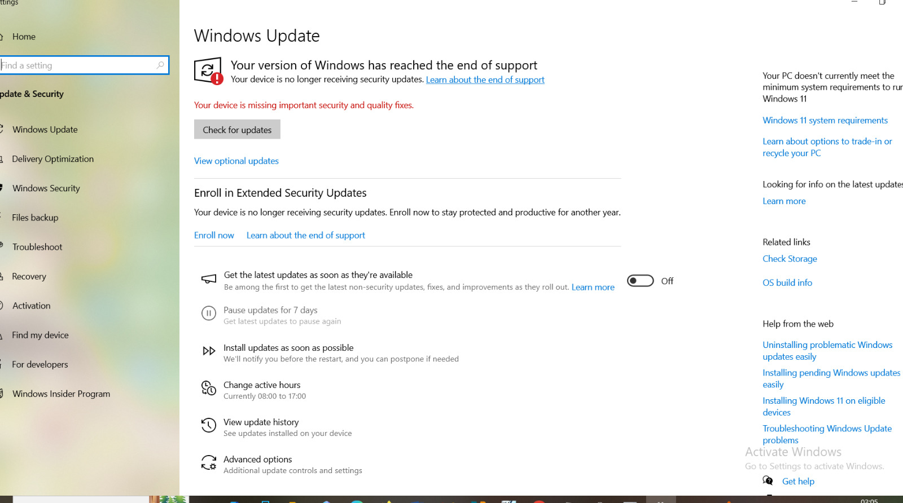
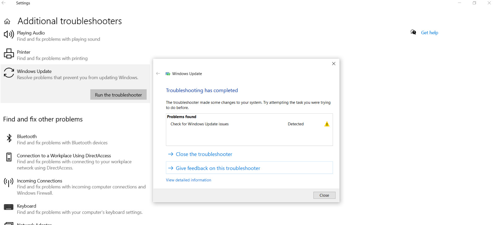

# Windows Update Failing to Install — Patch Management Troubleshooting

## Ticket Information

- **Category:** Windows / Patch Management / Desktop Support
- **Priority:** P2 – High
- **Impact:** Endpoint unable to receive security and feature updates
- **SLA Target:** 4 hours
- **Resolution Time:** 1 hour 15 minutes
- **Status:** Resolved

---

## 🧠 Scenario

In this lab, I worked through a situation where a user reported:

> “Windows updates keep failing and won’t install.”

The system kept prompting for updates, but they never completed successfully. Since this affects security and system stability, I treated it as a priority issue and started troubleshooting step by step.

---

## Environment

- **Device:** Windows 10 Workstation
- **Update Service:** Windows Update
- **Network:** Corporate LAN / Home Wi-Fi
- **User Permissions:** Standard User
- **Security:** Microsoft Defender enabled

---

## 🔍 Initial Symptoms

When I checked the device, I noticed:

- Updates showing as “Failed to Install”  
- Multiple failed attempts in Update History  
- System asking for restart without completing updates  
- No system crashes, but updates clearly not applying  

The system was still usable, but it wasn’t receiving security patches.

---

## 💼 Business Impact

Even though the system was still working, missing updates can leave it exposed to security risks.

In a real environment, this could lead to compliance issues or vulnerabilities if not fixed quickly.

---

## Investigation Steps

### Step 1 — Check Connectivity

I first confirmed the system had a stable internet connection.

ping google.com  

The test was successful, so I ruled out network issues early on.

---

### Step 2 — Review Update History

Next, I checked the Windows Update History.

I could see multiple failed updates, which confirmed the issue wasn’t just a one-time error.

---

### Step 3 — Restart Update Service

I restarted the Windows Update service (wuauserv) from Services.

After that, I tried installing updates again, but the issue was still there.

---

### Step 4 — Run Windows Update Troubleshooter

I ran the built-in Windows Update troubleshooter to see if it could detect anything automatically.

It completed, but didn’t fully resolve the issue.

---

### Step 5 — Check Disk Space

I verified that there was enough disk space available.

The system had more than enough free space, so that wasn’t the cause.

---

### Step 6 — Check Windows Version

At this point, I checked the Windows version using:

winver  

I noticed that the system was running an outdated version that had already reached end of support.

That explained why updates kept failing.

---

## 🧠 Root Cause

The system was running a Windows version that was no longer supported.

Because of this, it couldn’t receive new updates, and every update attempt failed.

---

## 🛠️ Resolution

To fix the issue, I:

- Confirmed the Windows version was unsupported  
- Recommended upgrading to a supported version  
- Backed up user data before making changes  
- Performed a Windows upgrade (to a supported version)  

After the upgrade, I tested Windows Update again.

---

## ✅ Verification

After upgrading the system:

- Updates downloaded and installed successfully  
- No more error messages in Update History  
- System restarted without issues  

I also confirmed everything was working normally, and the user reported no further problems.

---

## 🧑‍💻 Skills Demonstrated

- Diagnosed Windows Update failures using a structured approach  
- Identified update issues related to OS version lifecycle  
- Restarted and tested Windows services  
- Used built-in troubleshooting tools to isolate the issue  
- Performed OS upgrade to restore update functionality  
- Verified system security and update status after resolution  

---

## 🧠 Key Takeaway

This lab showed me that not all update issues are caused by system errors.

Sometimes the problem is simply that the system is running an outdated version that is no longer supported.

It also reinforced the importance of checking the basics first before going deeper into troubleshooting.

